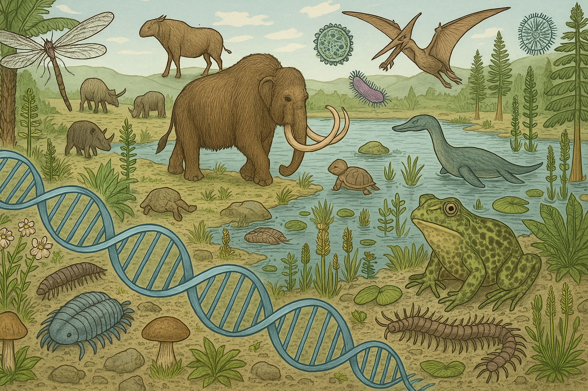

# Ancient Metagenomics

## Instructor

- Dr. Nikolay Oskolkov, Lund University, NBIS SciLifeLab

## Course overview
The study of ancient microbial, animal, and plant DNA from archaeological samples is a rapidly expanding field with significant potential for uncovering insights into past environments, lifestyles, and diseases. However, the limited quantity and degraded quality of ancient DNA pose significant challenges to computational analysis. In this course, we will explore the key challenges and analytical methods in ancient metagenomics, focusing on a comprehensive understanding and practical implementation of the ancient metagenomic workflow, aMeta.

## Target audience and assumed background
We assume some basic awareness of UNIX environment, as well as at least beginner level of R and / or Python programming.

## Learning outcomes
By completing this course, you will:

- Understand the basics of ancient microbial and environmental metagenomic analysis
- Have an overview of bioinformatic tools and best practices for ancient metagenomic analysis
- Be able to apply aMeta workflow to your ancient metagenomic samples
- Know key challenges, approaches and solutions in the ancient metagenomics research field
- Be able to choose the right tools and approaches to answer your specific research question 

---

# Schedule

## Before the course

| Time   | Activity                                                          | Link                                                                                                                                                    |
|--------|-------------------------------------------------------------------|---------------------------------------------------------------------------------------------------------------------------------------------------------|
| ~ 1 h  | Recorded talk: Microbiome Virtual International Forum (MVIF) 2024                                                         | [Video](https://www.youtube.com/watch?v=nIWpmUWAapM&t=39s)                                      |
| ~ 2 h  | aMeta publication in Genome Biology                                                                                       | [PDF](articles/aMeta_GenomeBiology_2023.pdf)                                                    |
| ~ 1 h  | In case needed: Recap on Unix                                                                                             | [Lab](command-line-basics.md)                                                                   |
| ~ 1 h  | Useful reading: Microbial contaminamination in eukaryotic reference genomes                                               | [Blog](https://www.biorxiv.org/content/10.1101/2025.03.19.644176v1)                             |
| ~ 1 h  | Useful reading: Fungal DNA in Ötzi's gut                                                                                  | [PDF](articles/Oskolkov_BMC_Genomics_2025.pdf)                                                  |
| ~ 1 h  | Useful reading: Filtering criteria for taxonomic classification with Kraken                                               | [Blog](https://www.biorxiv.org/content/10.1101/2025.03.31.646431v1)                             |

## Day 1: 2 pm - 8 pm Berlin time

| Time           | Activity                                                                                   | Link                                                                           |
|----------------|--------------------------------------------------------------------------------------------|--------------------------------------------------------------------------------|
| 14.00 - 14.45  | Course outline and practical information: introductions                                    | [Slides](slides/course-outline-and-practical-info.pdf)                         |
| 14.45 - 15.00  | Break                                                                                      |                                                                                |
| 15.00 - 16.00  | Introduction to biological Multi-Omics data integration via Machine Learning: key concepts | [Slides](slides/MachineLearningOmicsIntegration_Oskolkov.pdf)                  |
| 16.00 - 16.15  | Break                                                                                      |                                                                                |
| 16.15 - 17.15  | Feature selection and supervised Omics integration                                         | [Slides](slides/SupervisedOmicsIntegration_Oskolkov.pdf)                       |
| 17.15 - 17.30  | Break                                                                                      |                                                                                |
| 17.30 - 18.30  | Methods for univariate vs. multivariate feature selection: LASSO, PLS, LDA                 | [Lab](https://html-preview.github.io/?url=https://github.com/NikolayOskolkov/Physalia_MLOmicsIntegration_2025/blob/main/practicals/OmicsIntegration_FeatureSelection.html)                       |
| 18.30 - 18.45  | Break                                                                                      |                                                                                |
| 18.45 - 20.00  | Methods for supervised Omics integration: mixOmics and DIABLO                              | [Lab](https://html-preview.github.io/?url=https://github.com/NikolayOskolkov/Physalia_MLOmicsIntegration_2025/blob/main/practicals/supervised_omics_integr_CLL.html)                             |

## Day 2: 2 pm - 8 pm Berlin time

| Time           | Activity                                                                                    | Link                                                                           |
|----------------|---------------------------------------------------------------------------------------------|--------------------------------------------------------------------------------|
| 14.00 - 15.00  | Unsupervised Omics integration: factor analysis and graph intersection                      | [Slides](slides/UnsupervisedOmicsIntegration_Oskolkov.pdf)                     |
| 15.00 - 15.15  | Break                                                                                       |                                                                                |
| 15.15 - 16.45  | Methods for unsupervised Omics integration: MOFA1 and MOFA2                                 | [Lab](https://html-preview.github.io/?url=https://github.com/NikolayOskolkov/Physalia_MLOmicsIntegration_2025/blob/main/practicals/UnsupervisedOMICsIntegration_MOFA2.html)                     |
| 16.45 - 17.00  | Break                                                                                       |                                                                                |
| 17.00 - 18.00  | Applications of artificial neural networks and Deep Learning to biological data integration | [Slides](slides/DeepLearningOmicsIntegration_Oskolkov.pdf)                     |
| 18.00 - 18.15  | Break                                                                                       |                                                                                |
| 18.15 - 20.00  | Methods for Omics integration via neural networks: Autoencoder                              | [Lab](https://html-preview.github.io/?url=https://github.com/NikolayOskolkov/Physalia_MLOmicsIntegration_2025/blob/main/practicals/DeepLearningDataIntegration.html)                             |

## Day 3: 2 pm - 8 pm Berlin time

| Time           | Activity                                                                                        | Link                                                                           |
|----------------|-------------------------------------------------------------------------------------------------|--------------------------------------------------------------------------------|
| 14.00 - 15.00  | Dimensionality reduction and UMAP for single cell Omics integration                             | [Slides](slides/DimensionReduction_Oskolkov.pdf)                               |
| 15.00 - 15.15  | Break                                                                                           |                                                                                |
| 15.15 - 15.45  | Methods for dimension reduction: comparison between PCA, tSNE, UMAP                             | [Lab](https://html-preview.github.io/?url=https://github.com/NikolayOskolkov/Physalia_MLOmicsIntegration_2025/blob/main/practicals/OmicsIntegration_DimensionReduction.html)                     |
| 15.45 - 16.45  | Graph intersection method and UMAP application to single cell Omics integration                 | [Lab](https://html-preview.github.io/?url=https://github.com/NikolayOskolkov/Physalia_MLOmicsIntegration_2025/blob/main/practicals/UMAP_DataIntegration.html)                                    |
| 16.45 - 17.00  | Break                                                                                           |                                                                                |
| 17.00 - 18.00  | Batch correction (across samples) and Omics integration (across features) for single cell data  | [Slides](slides/Single_Cell_Integration_Oskolkov.pdf)                          |
| 18.00 - 18.15  | Break                                                                                           |                                                                                |
| 18.15 - 19.30  | Methods for Omics integration for single cell data: Seurat CCA + DTW, WNN                       | [Lab](https://html-preview.github.io/?url=https://github.com/NikolayOskolkov/Physalia_MLOmicsIntegration_2025/blob/main/practicals/SingleCell_OmicsIntegration.html)                             |
| 19.30 - 20.00  | Questions an discussion                                                                         |                                                                                |

