# Exercises

1. [Setting up the cloud computing](#setting-up-the-cloud-computing)
2. [Getting the raw data](#getting-the-raw-data)
3. [QC and trimming](#qc-and-trimming)
   1. [QC of the raw data](#qc-of-the-raw-data)
   2. [Read trimming](#read-trimming)
   3. [Host removal](#host-removal)
4. [Read-based taxonomic profiling](#read-based-taxonomic-profiling)
   1. [KrakenUniq](#krakenuniq)
   2. [Bonus: Kraken2](#bonus-kraken2)
   3. [Bonus: sourmash](#bonus-sourmash)
5. [Authentication analysis](#authentication-analysis)
   1. [Genomic hit confirmation](#genomic-hit-confirmation)
   2. [Ancient status](#ancient-specific-validation-criteria)
6. [Decontamination analysis](#microbiome-contamination-correction)
   1. [Microbial source tracking](#microbial-source-tracking)
   2. [Microbial contamination in eukaryotic references](#microbial-contamination-in-eukaryotic-references)
7. [aMeta ancient metagenomic workflow](ameta-introduction-and-installation)
8. [Metagenome assembly](#metagenome-assembly)
   1. [Assembly QC](#assembly-qc)
   2. [Abundance quantification of assembled contigs](#abundance-quantification-of-assembled-contigs)
   3. [Taxonomic annotation of assembled contigs](#taxonomic-annotation-of-assembled-contigs)

## Setting up the cloud computing

We will use the [Amazon Cloud](https://aws.amazon.com/ec2/) (AWS EC2) services for most of the analyses. The IP address of the remote machine will change every day, so a new IP adress will be posted in Slack each morning. Your username - that you have received by e-mail/Slack - will be the same for the whole course. We will use `ssh` to connect to the remote machine.

```bash
ssh -i ameta25.pem -XY ubuntu@54.202.26.255
```

Once you have connected to the remote machine, you will be in your home folder (`/users/userXX`, also represented by `~` or `$HOME`).
**Remember:** You can check where you are with the command `pwd`. To have access to the course's content, let's copy the GitHub repository to your `home` folder using `git clone`:

**Do this on the first day:** 

```bash
cd ~
git clone https://github.com/NikolayOskolkov/Physalia_AncientMetagenomics_2025
```

**Do this every once in a while, at least each day before starting the activities:**

```bash
cd ~/Physalia_AncientMetagenomics_2025
git pull
```

**Note:** All exercises will be executed inside the `Physalia_AncientMetagenomics_2025` folder that you cloned inside your own `home` folder. So remember to `cd ~/Physalia_AncientMetagenomics_2025` every time you connect to the remote machine.

## Getting the raw data

Here, we will use 10 simulated with [gargammel](https://academic.oup.com/bioinformatics/article/33/4/577/2608651) ancient metagenomic samples from Pochon et al. 2023. The simulated data can be accessed via [https://doi.org/10.17044/scilifelab.21261405](https://doi.org/10.17044/scilifelab.21261405).

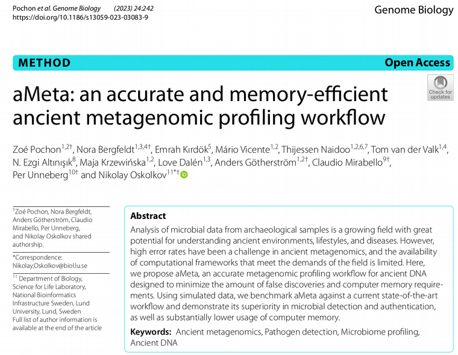

To download the simulated ancient metagenomic data you can use the following command line:

```bash
# DO NOT RUN THIS (ALREADY DONE)
wget https://figshare.scilifelab.se/ndownloader/articles/21261405/versions/1 \
&& unzip 1 && rm 1
```

Copy the raw sequencing data to your own `01_DATA` folder. Also copy the file `SAMPLES.txt`, which will be useful for running `for loop` and etc.

```bash

cd ~/Physalia_AncientMetagenomics_2025
mkdir 01_DATA

cp ~/Share/data/*.fastq.gz 01_DATA/
cp ~/Share/data/SAMPLES.txt ./
```

Let us now explore the data a little bit. First of all, we can look inside the gzipped-file without unzipping with `zcat`:

```bash
zcat 01_DATA/sample1.fastq.gz | head
```

You should see 4 lines corresponding to each read: the first line contains the read ID (each starting with @), the second line corresponds to the sequence of the read, the third line is the delimiter and the fourth line contains ASCII quality scores for eac sequenced nucleotide.

Let us now count the number of reads in the fastq-files:

```bash
zcat 01_DATA/sample1.fastq.gz | grep -c ^@
```

How many reads do we have in the fastq-files?


## QC and trimming

Now that you have copied the raw data to your working directory, let's do some quality control. The sequencing process is subject to several types of problems that can introduce errors and artifacts in the sequences. Because of this, bioinformatics analyses usually start with the quality control of raw sequences. He we will use [FastQC](https://www.bioinformatics.babraham.ac.uk/projects/fastqc) and [MultiQC](https://multiqc.info/) to obtain quality reports, and [Cutadapt](https://cutadapt.readthedocs.io/en/stable/) for trimming the Illumina data, respectively.

### QC of the raw data

Go to your `Physalia_AncientMetagenomics_2025` folder, create a folder for the QC files, and activate the `conda` environment:

```bash
cd ~/Physalia_AncientMetagenomics_2025
mkdir 02_QC_RAW
conda activate aMeta
```

And now you're ready to run the QC on the raw data:

```bash
fastqc 01_DATA/*.fastq.gz -o 02_QC_RAW -t 4
multiqc 02_QC_RAW -o 02_QC_RAW --interactive
```

After the QC is finished, copy the `MultiQC` report (`02_QC_RAW/multiqc_report.html`) to your local machine and open it with your favourite browser. We will go through the report together before continuing with the pre-processing.

**NOTE:** to move files to and from local and remote machines, you can use: 
- The command-line tool [scp](https://kb.iu.edu/d/agye)
- A file transfer software such as [FileZilla](https://filezilla-project.org)

Below we provide an example (please note that the IP address should be changed) of copying files to you local computer via `scp` command-line tool:

```bash
scp -r -i ameta25.pem ubuntu@54.244.63.96:/home/ubuntu/Physalia_AncientMetagenomics_2025/02_QC_RAW/* .
```

### Read trimming

Our QC reports tell us that a significant percentage of the raw sequences contain some isses such as the presence of adapters. Before proceeding, it is necessary to clean up/trim the raw sequences. Before start trimming the data, let's create a folder for the processed data and activate the `conda` environment:

```bash
cd ~/Physalia_AncientMetagenomics_2025
mkdir 03_TRIMMED
conda activate aMeta
```

For the Illumina data, we will use a `for loop` to process each of the samples one after the other:

```bash
for sample in $(cat SAMPLES.txt); do
  cutadapt 01_DATA/${sample}.fastq.gz \
           -o 03_TRIMMED/${sample}.trimmed.fastq.gz \
           -a AGATCGGAAGAG \
           -m 50 \
           -q 20 \
           -j 4 > 03_TRIMMED/${sample}.log
done
```

While `Cutadapt` is running: looking at the [online manual](https://cutadapt.readthedocs.io/en/stable/index.html) or running `cutadapt --help`, answer:

- What do the `-o`, `-a`, `m`, `-q`, and `-j` flags mean?
- How did we choose the values for `-m` and `-q`?
- What is the purpose of the redirection (`> 03_TRIMMED/${sample}.log`)?


### Bonus: trimming and merging PE reads with fastp, solving polyG-tails problem

```bash

#DO NOT RUN (OUR DATA ARE SE AND NOT PE)
conda activate ancientmetagenomics

for sample in $(cat SAMPLES.txt); do
fastp --in1 ${sample}_R1.fastq.gz --in2 ${sample}_R2.fastq.gz -p -c \
--merge --merged_out=${sample}.trimmed_merged.fastq.gz \
-h ${sample}_fastp_report.html -j ${sample}_fastp_report.json -w 20 -l 30
done
```


### QC of the trimmed data

Now the data has been trimmed, it would be a good idea to run `FastQC` and `MultiQC` again. Modify the [commands used for the raw data](#qc-of-the-raw-data) to match the trimmed data and run the two QC softwares.

While you wait, take a look at the `Cutadapt` logs. When `Cutadapt` runs, it prints lots of interesting information to the screen, which we lose once we logout of the remote machine. Because we used redirection (`>`) to capture the standard output (`stdout`) of `Cutadapt`, this information is now stored in a file (`03_TRIMMED/${sample}.log`). Take a look at the log file for one of the samples using the program `less`:

**NOTE:** You can scroll up and down using the arrow keys on your keyboard, or move one "page" at a time using the spacebar.
**NOTE:** To quit `less`, hit the `q` key.

By looking at the `Cutadapt` log, can you answer:
- How many read pairs we had originally?
- How many reads contained adapters?
- How many read pairs were removed because they were too short?
- How many base calls were quality-trimmed?
- Overall, what is the percentage of base pairs that were kept?

When `FastQC` and `MultiQC` have finished, copy the `MultiQC` report to your local machine and open it with a browser. Compare this with the report obtained earlier for the raw data. Do the data look better now?


## Host removal

Even if you work with environmental samples, it is quite likely that human DNA is also present in your sample, in this sense it is considered as contamination. Therefore, to be on a safe side, it is a good practice to explicitely clean your data from it. 
If you work with host-associated microbiome, i.e. human microbiome, this is a mandatory step, please see [here](https://retractionwatch.com/2024/06/26/all-authors-agree-to-retraction-of-nature-article-linking-microbial-dna-to-cancer/) what can happen if you do not properly clean your data from human DNA. Here, we demonstrate how to practically perfrom the host removal step.


```bash
# DO NOT RUN THIS (ALREADY DONE): download and index human reference genome
# wget http://hgdownload.soe.ucsc.edu/goldenpath/hg38/bigZips/hg38.fa.gz
# bowtie2-build --large-index hg38.fa.gz hg38.fa.gz --threads 20

cd ~/Physalia_AncientMetagenomics_2025
mkdir 04_HOST_REMOVAL
conda activate aMeta

for sample in $(cat SAMPLES.txt); do
	bowtie2 --large-index -x ~/Share/Databases/hg38/hg38.fa.gz --end-to-end --threads 4 --very-sensitive \
	03_TRIMMED/${sample}.trimmed.fastq.gz | samtools view -bS -h -@ 4 - \
	> 04_HOST_REMOVAL/${sample}_aligned_to_hg38.bam
	
	samtools sort 04_HOST_REMOVAL/${sample}_aligned_to_hg38.bam -@ 4 \
	> 04_HOST_REMOVAL/${sample}_aligned_to_hg38.sorted.bam
	
	samtools index 04_HOST_REMOVAL/${sample}_aligned_to_hg38.sorted.bam
	samtools view -b -f 4 04_HOST_REMOVAL/${sample}_aligned_to_hg38.sorted.bam \
	> 04_HOST_REMOVAL/${sample}_unaligned_to_hg38.bam

	samtools bam2fq 04_HOST_REMOVAL/${sample}_unaligned_to_hg38.bam | gzip \
	> 04_HOST_REMOVAL/${sample}_unaligned_to_hg38.fastq.gz
done
```
Above, we constructed a fastq-file which is free from human DNA. This was done by aligning the trimmed reads to the human reference genome and extracting unaligned reads only. This human-free fastq-file can now be used for different purposes, such as taxonomic profiling or de-novo assembly.

## Read-based taxonomic profiling

There are many different tools and approaches for obtaining taxonomic profiles from metagenomes. Here we will use a popular read-based taxonomic profiler [Kraken2](https://github.com/DerrickWood/kraken2) and [sourmash](https://sourmash.readthedocs.io/en/latest/). What is the basic approach that each of these tools use and how they can impact the results? Well, let's find out!

First let's create a folder to store the results:

```bash
cd ~/Physalia_AncientMetagenomics_2025
mkdir 05_TAXONOMIC_PROFILE
conda activate aMeta
```


### KrakenUniq

To profile the data with KrakenUniq one needs a database, a pre-built complete microbial NCBI RefSeq database can be accessed via [https://doi.org/10.17044/scilifelab.21299541](https://doi.org/10.17044/scilifelab.21299541). Please use the following command line to download the databse:

```bash
# DO NOT RUN (ALREADY DONE)
wget https://figshare.scilifelab.se/ndownloader/articles/21299541/versions/1 \
&& unzip 1 && rm 1
```


Then, taxonomic k-mer-based classification of the ancient metagenomic reads can be done via KrakenUniq:

```bash
for sample in $(cat SAMPLES.txt); do
krakenuniq --db ~/Share/Databases/KrakenUniq_DB \
--fastq-input 04_HOST_REMOVAL/${sample}_unaligned_to_hg38.fastq.gz \
--threads 4 --classified-out 05_TAXONOMIC_PROFILE/${sample}.classified_sequences.krakenuniq \
--unclassified-out 05_TAXONOMIC_PROFILE/${sample}.unclassified_sequences.krakenuniq \
--output 05_TAXONOMIC_PROFILE/${sample}.sequences.krakenuniq \
--report-file 05_TAXONOMIC_PROFILE/${sample}.krakenuniq.output
done
```

KrakenUniq by default delivers a proxy metric for breadth of coverage called the **number of unique kmers** (in the 4th column of its output table) assigned to a taxon. KrakenUniq output can be easily filtered with respect to both depth and breadth of coverage, which substantially reduces the number of false-positive hits.
 
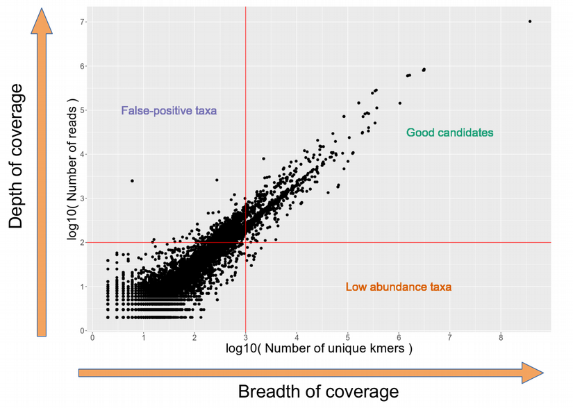

We can filter the KrakenUniq output with respect to both depth (*taxReads*) and breadth (*kmers*) of coverage with the following custom Python script, which selects only species with at east 200 assigned reads and 1000 unique k-mers. After the filtering, we can see a *Yersinia pestis* hit in the *sample 10* that passess the filtering thresholds with respect to both depth and breadth of coverage.

```bash
cd 05_TAXONOMIC_PROFILE
for i in $(ls *.krakenuniq.output)
do
~/Share/scripts/filter_krakenuniq.py $i 1000 200 ~/Share/scripts/pathogenomesFound.tab
done
cd ..
```

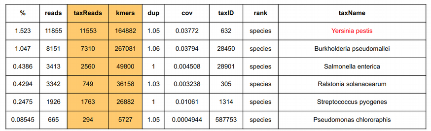


We can also easily produce a KrakenUniq taxonomic abundance table *krakenuniq_abundance_matrix.txt* using the custom R script below, which takes as argument the folder *KRAKENUNIQ* containing the KrakenUniq output files. From the *krakenuniq_abundance_matrix.txt* table, it becomes clear that *Yersinia pestis* seems to be present in a few other samples in addition to sample 10.

```bash
Rscript ~/Share/scripts/krakenuniq_abundance_matrix.R 05_TAXONOMIC_PROFILE \
06_KRAKENUNIQ_ABUNDANCE_MATRIX 1000 200
```

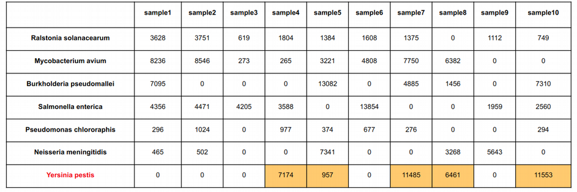


Now that we have got our hands into some tables describing the abundance of the different taxa in our metagenome, it is time to make sense of the data. One way to do this is by making summaries, plots, statistical tests, etc, as you would normally do for any kind of species distribution data. Here you are free to use whichever tool you are most familiar with.

The idea here is to: 
- Learn what are the main (most abundant) taxa in our sample.
- Learn about potential differences in community composition between the samples.
- Learn what fraction of the community we were actually able to identify at, let's say, the genus level.
- Compare the taxonomic profiles obtainted from Illumina and Nanopore data.

Hopefully you will be able to learn a bit about these metagenomic datasets. And realize that there is so much that still remains unknown... We recommend to use [R / Rstudio](https://posit.co/download/rstudio-desktop/) for visualization of microbial abundances in your sample. For example, one can use [Pavian](https://github.com/fbreitwieser/pavian) tool:

```R
# explore abundance in Pavian https://github.com/fbreitwieser/pavian
if (!require(remotes)) { install.packages("remotes") }
remotes::install_github("fbreitwieser/pavian")
pavian::runApp(port=5000)
```

In Pavian you can upload your KrakenUniq report files ending by *krakenuniq.output, and visualize abundances of organisms via [Sankey](https://en.wikipedia.org/wiki/Sankey_diagram) plot. Another popular way of visualization of your data is [Krona](https://bmcbioinformatics.biomedcentral.com/articles/10.1186/1471-2105-12-385) which can be installed and used from https://github.com/marbl/Krona.

While KrakenUniq delivers information about breadth of coverage by default, one has to use a special flag *--report-minimizer-data* when running Kraken2 in order to get the breadth of coverage proxy which is called the **number of distrinct minimizers** for the case of Kraken2. Below, we provide an example Kraken2 command line containing the distinct minimizer flag.


### Bonus: Kraken2

And now let's run `Kraken2`. Kraken2 is a taxonomic sequence classifier that assigns taxonomic labels to DNA sequences. Kraken2 examines the k-mers within a query sequence and uses the information within those k-mers to query a database. 
That database maps k-mers to the lowest common ancestor (LCA) of all genomes known to contain a given k-mer.

```bash
# You will have to download a Kraken2 database (for example, MiniKraken):
# wget https://genome-idx.s3.amazonaws.com/kraken/minikraken2_v2_8GB_201904.tgz
# tar -xzvf minikraken2_v2_8GB_201904.tgz

conda deactivate
conda activate ancientmetagenomics

for sample in $(cat SAMPLES.txt); do
  kraken2 --db ~/Share/Databases/minikraken2_v2_8GB_201904_UPDATE \
	  --fastq-input 04_HOST_REMOVAL/${sample}_unaligned_to_hg38.fastq.gz \
	  --output 05_TAXONOMIC_PROFILE/${sample}_sequences.kraken2 \
	  --report 05_TAXONOMIC_PROFILE/${sample}_kraken2.output \
	  --report-minimizer-data --use-names --threads 4
done
```

Then the filtering of Kraken2 output with respect to breadth and depth of coverage can be done by analogy with filtering KrakenUniq output table. In case of *de-novo* assembly, the original DNA reads are typically alligned back to the assembled contigs, and the evennes / breadth of coverage can be computed from these alignments.


### Bonus: sourmash

There are many different appraoches for taxonomic profiling of metagenomes, each of them with their own up- and downsides. Let's now try a `sourmash`. Sourmash is k-mer-based, similar to Kraken2, Bracken, and Centrifuge, but uses k-mers from across the entire dataset, rather than individual reads, to find best-match genomes. In this way, it is able to leverage longer-range information present in a dataset, though not across reads themselves.

```bash
# You will have to download the database:
# wget https://farm.cse.ucdavis.edu/~ctbrown/sourmash-db/gtdb-rs207/gtdb-rs207.genomic-reps.dna.k31.zip
# wget https://farm.cse.ucdavis.edu/~ctbrown/sourmash-db/gtdb-rs207/gtdb-rs207.taxonomy.with-strain.csv.gz

conda activate ancientmetagenomics

for sample in $(cat SAMPLES.txt); do
  sourmash sketch dna 04_HOST_REMOVAL/${sample}_unaligned_to_hg38.fastq.gz \
                      -p k=31,scaled=1000,abund \
                      -o 05_TAXONOMIC_PROFILE/${sample}.sig.zip \
                      --merge ${sample}

  sourmash gather 05_TAXONOMIC_PROFILE/${sample}.sig.zip \
                  ~/Share/Databases/sourmash/gtdb-rs207.genomic-reps.dna.k31.zip \
                  -k 31 --threshold-bp 10 \
                  -o 05_TAXONOMIC_PROFILE/${sample}.gather.csv
done

# Gather results per phylum and genus
sourmash tax metagenome -g 05_TAXONOMIC_PROFILE/*.gather.csv \
                        -t ~/Share/Databases/sourmash/gtdb-rs207.taxonomy.with-strain.csv.gz \
                        --output-dir 05_TAXONOMIC_PROFILE \
                        --output-base sourmash.phylum \
                        --output-format lineage_summary \
                        --rank phylum

sourmash tax metagenome -g 05_TAXONOMIC_PROFILE/*.gather.csv \
                        -t ~/Share/Databases/sourmash/gtdb-rs207.taxonomy.with-strain.csv.gz \
                        --output-dir 05_TAXONOMIC_PROFILE \
                        --output-base sourmash.genus \
                        --output-format lineage_summary \
                        --rank genus
```

Now analyse the results from `sourmash` in `R` or other data analysis tool of your preference. Are there differences between the taxonomic profiles obtained by the two different tools?


## Authentication analysis

In ancient metagenomics we typically try to answer two questions: "Who is there?" and "How ancient?", meaning we would like to detect an organism and investigate whether this organism is ancient. There are three typical ways to identify the presence of an organism in a metagenomic sample:

- alignment of DNA fragments to a reference genome ([Bowtie](https://www.ncbi.nlm.nih.gov/pmc/articles/PMC3322381/), [BWA](https://pubmed.ncbi.nlm.nih.gov/19451168/), [Malt](https://www.biorxiv.org/content/10.1101/050559v1) etc.)
- taxonomic (kmer-based) classification of DNA fragments ([Kraken](https://genomebiology.biomedcentral.com/articles/10.1186/s13059-019-1891-0), [MetaPhlan](https://www.nature.com/articles/s41587-023-01688-w), [Centrifuge](https://www.ncbi.nlm.nih.gov/pmc/articles/PMC5131823/) etc.)
- *de-novo* genome assembly ([Megahit](https://academic.oup.com/bioinformatics/article/31/10/1674/177884), [metaSPAdes](https://www.ncbi.nlm.nih.gov/pmc/articles/PMC5411777/) etc.)

The first two are reference-based, i.e. they assume a similarity of a query ancient DNA fragment to a modern reference genome in a database. This is a strong assumption, which might not be true for very old or very diverged ancient organisms. This is the case when the reference-free *de-novo* assembly approach becomes prowerful. However, *de-novo* assembly has its own computational challenges for low-coverage ancient metagenomic samples that typically contain very short DNA fragments.

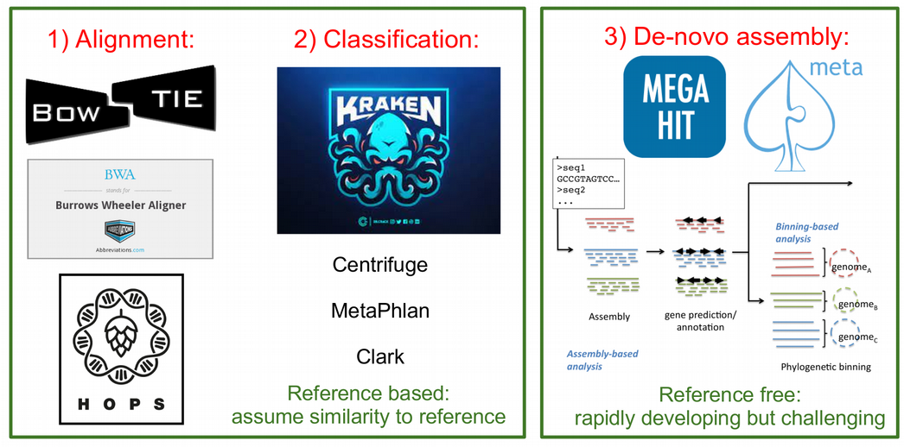

While all the three types of metagenomic analysis are suitable for exploring composition of metagenomic samples, they do not directly validate the findings or provide information about ancient or endogenous status of the detected organims. It can happen that the detected organism

1. was mis-identified (the DNA belongs to another organism than initially thought),
2. has a modern origin (for example, lab or sequencing contaminant)
3. is of exogenous origin (for example, an ancient microbe that entered the host *post-mortem*). 

Therefore, additional analysis is needed to follow-up each hit and demonstrate its ancient origin. Below, we describe a few steps that can help ancient metagenomic researchers to verify their findings and put them into biological context.

In this section, we will cover:

- how to recognize that a detected organism was mis-identified based on breadth / evenness of coverage
- how to validate findings by breadth of coverage filters via k-mer based taxonomic classification with KrakenUniq
- how to validate findings using alignments and assess mapping quality, edit distance and evenness of coverage profile
- how to detect modern contaminants via deamination profile, DNA fragmentation and post-mortem damage (PMD) scores
- how negative (blank) controls can help disentangle ancient organisms from modern contaminants
- how microbial source tracking can facilitate separating endogenous and exogenous microbial communities

The section has the following outline:

- Introduction
- Simulated ancient metagenomic data
- Genomic hit confirmation (how we see a true-positive hit)
  - Modern validation criteria
    - evenness and breadth of coverage
    - alignment quality (edit distance, mapq)
    - affinity to reference (percent identity, multi-allelic SNPs)
  - Ancient-specific validation
    - deamination profile (PMD scores)
    - DNA fragmentation
- Microbiome contamination correction
  - Decontamination via negative controls (blanks)
  - Similarity to expected microbiome source (microbial source tracking)


## Genomic hit confirmation

Once an organism has been detected in a sample (via alignment, classification or *de-novo* assembly), one needs to take a closer look at multiple quality metrics in order to reliably confrm that the organism is not a false-positive detection and is of ancient origin. The methods used for this purpose can be divided into modern validation and ancient-specific validation criteria. Below, we will cover both of them.


## Modern validation criteria

The modern validation methods aim at confirming organism presence regradless of its ancient status. The main approaches include evenness / breadth of coverage computation, assessing alignmnet quality, and monitoring affinity of the DNA reads to the reference genome of the potential host.


### Depth vs breadth and evenness of coverage

Concluding organism presence by relying solely on the numbers of assigned sequenced reads (aka depth of coverage metric) turns out to be not optimal and too permissive, which may result in a large amount of false-positive discoveries. For example, when using alignment to a reference genome, the mapped reads may demonstrate non-uniform coverage as visualized in the [Integrative Genomics Viewer (IGV)](https://software.broadinstitute.org/software/igv/) below.

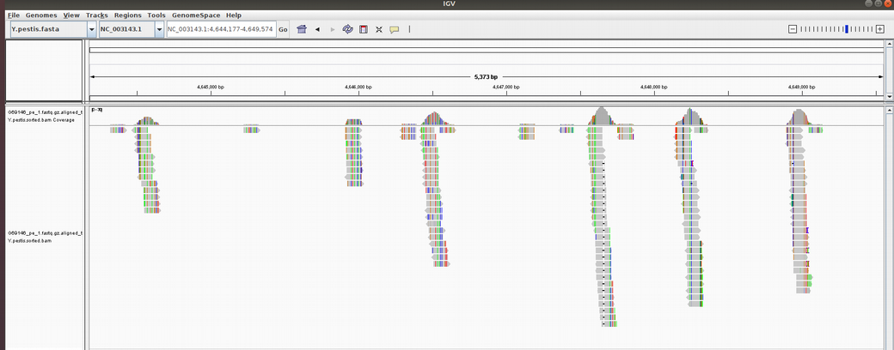

In this case, DNA reads originating from another microbe were (mis-)aligned to *Yersina pestis* reference genome. It can be observed that a large numer the reads align only to a few conserved genomic loci. Therefore, even if many thousands of DNA reads are capable of aligning to the reference genome, the overall uneven alignment pattern suggests no presence of *Yersina pestis* in the metagenomic sample. Thus, not only the number of assigned reads (proportinal to depth of coverage metric) but also the **breadth and evenness of coverage** metrics become of particular importance for veryfication of metagenomic findings, i.e. hits with DNA reads uniformly aligned across the reference genome are more likely to be true-positive detections.

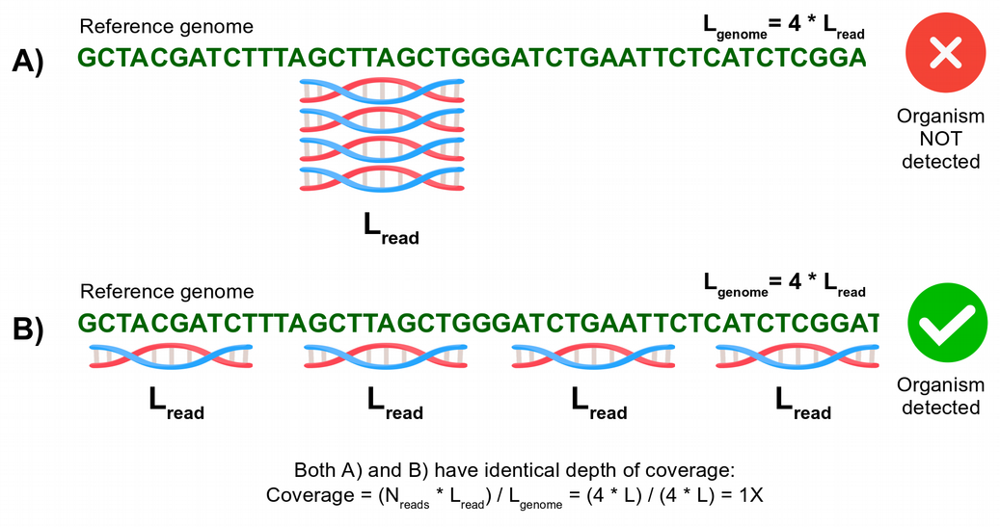

In the next sections, we will show how to practically compute the breadth and evenness of coverage via KrakenUniq and Samtools.


### Breadth of coverage via KrakenUniq

Here we are going to demonstrate that one can assess breadth of coverage information already at the taxonomic profiling step. Although taxonomic classifiers do not perform alignment, some of them, such as [KrakenUniq](https://genomebiology.biomedcentral.com/articles/10.1186/s13059-018-1568-0) and [Kraken2](https://genomebiology.biomedcentral.com/articles/10.1186/s13059-019-1891-0) provide a way to infer breadth of coverage in addition to the number of assigned reads to a taxon. This allows for immediate filtering out a lot of false positive hits. Since Kraken-family classifiers are typically faster and [less memory-demanding](https://www.biorxiv.org/content/10.1101/2022.06.01.494344v1.full.pdf), i.e. can work with very large reference databases, compared to genome aligners, they provide a robust and fairly unbiased initial taxonomic profiling, which can still later be followed-up with proper alignment and computing evenness of coverage as described above.

In the Taxonomic Profiling section we saw how the output of KrakenUniq was filtered using the unique k-mer information. We concluded thay *Yersinia pestis* pathogen was present in the *sample10*. This conclusion is quite reliable with the unique k-mers information from KrakenUniq alone, however it is highly reommened to follow up this hit with proper alignments (remember, KrakenUniq is not doing alignments!) and visualization of the genome coverage using *samtools*, we will do this in the next section.


### Evenness of coverage via Samtools

Now, after we have detected an interesting *Y. pestis* hit, we would like to follow it up, and compute multiple quality metrics (including proper breadth and evenness of coverage) from alignments (Bowtie2 aligner willl be used in our case) of the DNA reads to the *Y. pestis* reference genome. Below, we download *Yersinia pestis* reference genome from NCBI, build its Bowtie2 index, and align trimmed reads against *Yersinia pestis* reference genome with Bowtie2. Do not forget to sort and index the alignments as it will be important for computing the evenness of coverage. It is also recommended to remove multi-mapping reads, i.e. the ones that have MAPQ = 0, at least for Bowtie and BWA aligners that are commonly used in ancient metagenomics. Samtools with *-q* flag can be used to extract reads with MAPQ > = 1.

```bash
cd ~/Physalia_AncientMetagenomics_2025
mkdir 07_AUTHENTICATION
cd 07_AUTHENTICATION

conda activate ancientmetagenomics

NCBI=https://ftp.ncbi.nlm.nih.gov; ID=GCF_000222975.1_ASM22297v1
wget $NCBI/genomes/all/GCF/000/222/975/${ID}/${ID}_genomic.fna.gz

gunzip ${ID}_genomic.fna.gz; echo NC_017168.1 > region.bed
seqtk subseq ${ID}_genomic.fna region.bed > NC_017168.1.fasta
bowtie2-build --large-index NC_017168.1.fasta NC_017168.1.fasta --threads 20

bowtie2 --large-index -x NC_017168.1.fasta --end-to-end --threads 20 \
--very-sensitive -U ../03_TRIMMED/sample10.trimmed.fastq.gz | samtools view -bS \
-h -q 1 -@ 20 - > Y.pestis_sample10.bam
samtools sort Y.pestis_sample10.bam -@ 20 > Y.pestis_sample10.sorted.bam
samtools index Y.pestis_sample10.sorted.bam
```

Next, the breadth / evenness of coverage can be visualized via *samtools coverage* as follows:

```bash
samtools coverage Y.pestis_sample10.sorted.bam -m
```

Alternatively, you can compute the coverage for each genomic positionfrom the BAM-alignments via *samtools depth*:

```bash
samtools depth -a Y.pestis_sample10.sorted.bam > Y.pestis_sample10.sorted.boc
```

then, you can download the **.boc*-file it to your computer and visualize using for example the following R code snippet (alternatively [aDNA-BAMPlotter](https://github.com/MeriamGuellil/aDNA-BAMPlotter) can be used):

```R
# Read output of samtools depth command
df <- read.delim("Y.pestis_sample10.sorted.boc", header = FALSE, sep = "\t")
names(df) <- c("Ref", "Pos", "N_reads")

# Split reference genome in tiles, compute breadth of coverage for each tile
N_tiles <- 500
step <- (max(df$Pos) - min(df$Pos)) / N_tiles
tiles <- c(0:N_tiles) * step; boc <- vector()
for(i in 1:length(tiles))
{
  df_loc <- df[df$Pos >= tiles[i] & df$Pos < tiles[i+1], ]
  boc <- append(boc, rep(sum(df_loc$N_reads > 0) / length(df_loc$N_reads),
  dim(df_loc)[1]))
}
boc[is.na(boc)]<-0; df$boc <- boc
plot(df$boc ~ df$Pos, type = "s", xlab = "Genome position", ylab = "Coverage")
abline(h = 0, col = "red", lty = 2)
mtext(paste0(round((sum(df$N_reads > 0) / length(df$N_reads)) * 100, 2), 
"% of genome covered"), cex = 0.8)
```

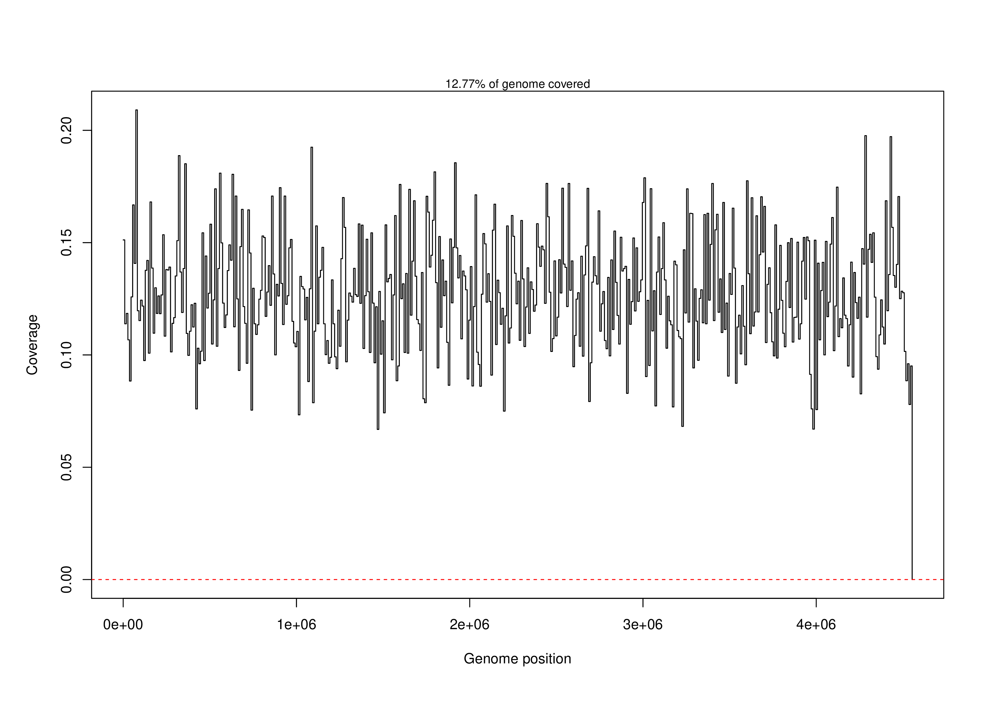

In the R script above, we simply split the reference genome into *N_tiles* tiles and compute the breadth of coverage (number of reference nucleotides covered by at least one read normalized by the total length) locally in each tile. By visualizing how the local breadth of coverage changes from tile to tile, we can monitor the distribution of the reads across the reference genome. In the evenness of coverage figure above, the reads seem to cover all parts of the reference genome uniformly, which is a good evidence of true-positive detection, even though the total mean breadth of coverage is low due to the low total number of reads.


### Alignment quality

In addition to evenness and breadth of coverage, it is very informative to monitor how well the metagenomic reads map to a reference genome. Here one can control for **mapping quality** ([MAPQ](https://samtools.github.io/hts-specs/SAMv1.pdf) field in the BAM-alignments) and the number of mismatches for each read, i.e. **edit distance**.

Mapping quality (MAPQ) can be extracted from the 5th column of BAM-alignments using Samtools and *cut* command in bash.

```bash
samtools view Y.pestis_sample10.sorted.bam | cut -f5 > mapq.txt
```

Then the 5th column of the filtered BAM-alignment can be visualized via a simple histogram in R as below for two random metagenomic samples.

```R
hist(as.numeric(readLines("mapq.txt")), col = “darkred”, breaks = 100)
```

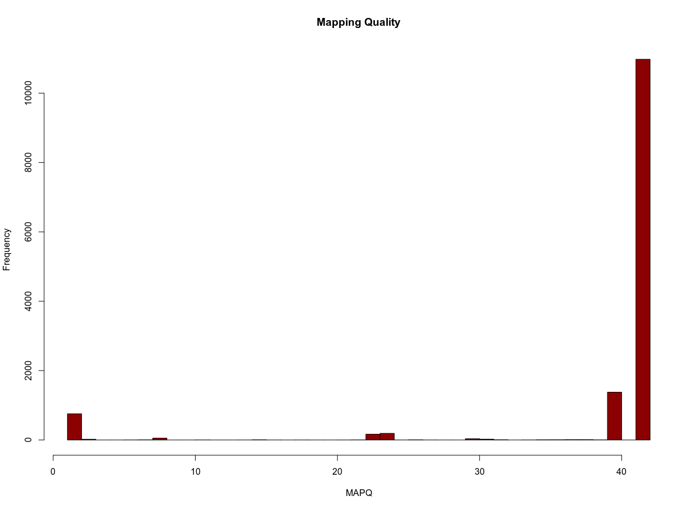

Note that MAPQ scores are computed slightly differently for Bowtie and BWA, so they are not directly comparable, however, for both MAPQ ~ 10-30, as in the histograms below, indicates good affinity of the DNA reads to the reference genome. here we provide some examples of how typical MAPQ histograms for Bowtie2 and BWA alignments can look like:

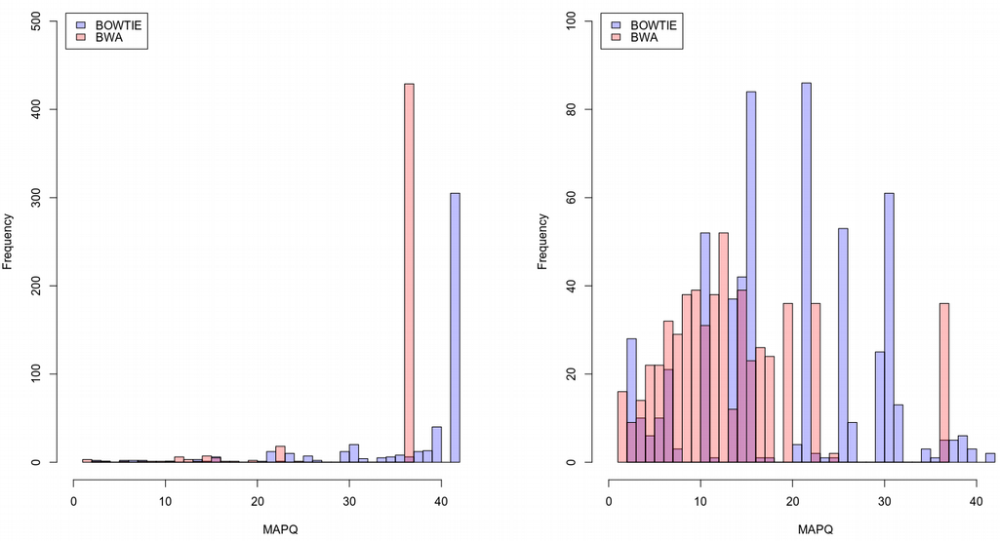


Edit distance can be extracted by gathering information in the NM-tag inside BAM-alignemnts, which reports the number of mismatches for each aligned read. This can be done either in bash / awk, or using handy functions from *Rsamtools* R package:

```R
library("Rsamtools")
param <- ScanBamParam(tag = "NM")
bam <- scanBam("Y.pestis_sample10.sorted.bam", param = param)
barplot(table(bam[[1]]$tag$NM), ylab="Number of reads", xlab="Number of mismatches")
```

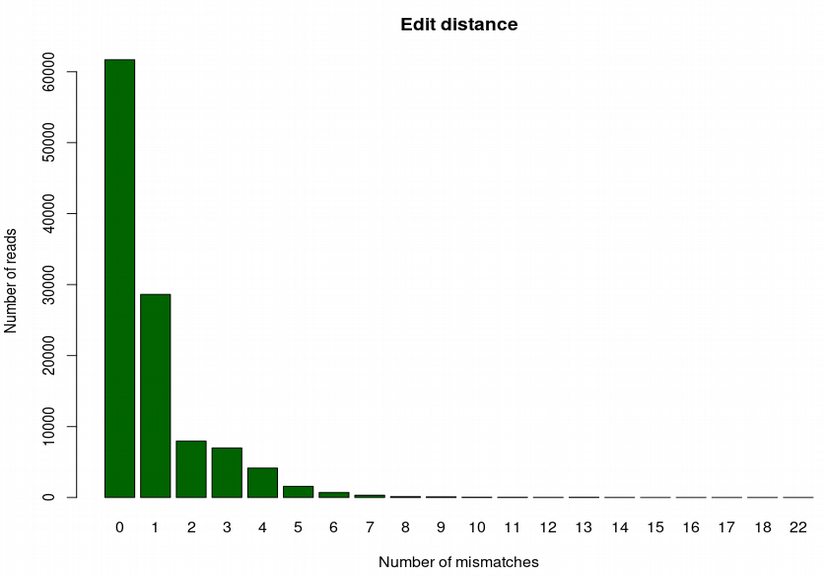


In the barplot above we can see that the majority of reads align either without or with very few mismatches, which is an evidence of high affinity of the aligned reads with respect to the reference genome. For a true-positive finding, the edit distance barplot typically has a decreasing profile. However, for a very degraded DNA, it can have a mode around 1 or 2, which can also be reasonable. A fasle-positive hit would have a mode of the edit distance barplot shifted toward higher numbers of mismatches.


### Affinity to reference

Very related to edit distance is another alignment validation metric which is called **percent identity**. It represents a barplot demonstrating the numbers of reads that are 100% identical to the reference genome (i.e. map without a single mismatch), 99% identical, 98% identical etc. Misaligned reads originating from another related organism have typically most reads with percent identity of 93-96%. In the figure below, the panels (c–e) demonstrate different percent identity distributions. In panel c, most reads show a high similarity to the reference, which indicates a correct assignment of the reads to the reference. In panel d, most reads are highly dissimilar to the reference, which suggests that they originate from different related species. In some cases, as in panel e, a mixture of correctly assigned and misassigned reads can be observed. 

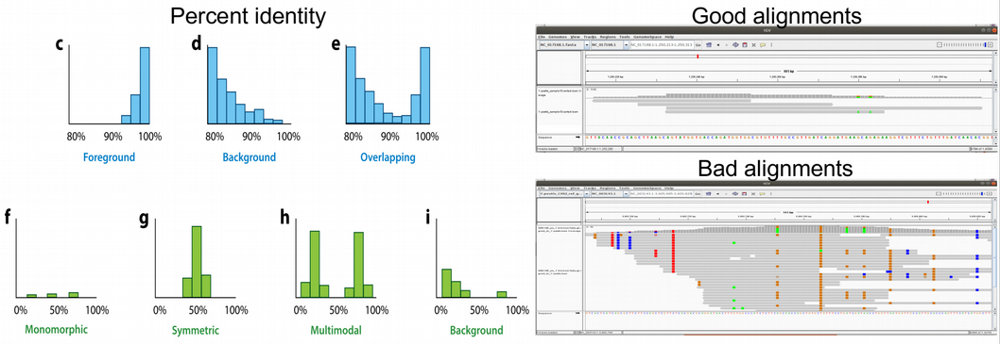

Another important way to detect reads that cross-map between related species is **haploidy** or checking the amount of **multi-allelic SNPs**. Because bacteria are haploid organisms, only one allele is expected for each genomic position. Only a small number of multiallelic sites are expected, which can result from a few misassigned or incorrectly aligned reads. In the figure above, panels (f–i) demonstrate histograms of SNP allele frequency distributions. Panel f demonstrates the situation when we have only a few multiallelic sites originating from a misaligned reads. This is a preferrable case scenario corresponding to correct assignment of the reads to the reference. Please also check the corresponding "Good alignments" IGV visualization to the right in the figure above.

In contrast, a large number of multiallelic sites indicates that the assigned reads originate from more than one species or strain, which can result in symmetric allele frequency distributions (e.g., if two species or strains are present in equal abundance) (panel g) or asymmetric distributions (e.g., if two species or strains are present in unequal abundance) (panel h). A large number of misassigned reads from closely related species can result in a large number of multiallelic sites with low frequencies of the derived allele (panel i). The situations (g-i) correspond to incorrect assignment of the reads to the reference. Please also check the corresponding "Bad alignments" IGV visualization to the right in the figure above.


## Ancient-specific validation criteria

In contrast to modern genomic hit validation criteria, the ancient-specific validation methods concentrate on DNA degradation and damage pattern as ultimate signs of ancient DNA. Below, we will discuss demination profile, read length distribution and post mortem damage (PMD) scores metrics that provide good confirmation of ancient origin of the detected organism.


### Ancient status

Checking evenness of coverage and alignment quality can help us to make sure that the organism we are thinking about is really present in the metagenomic sample. However, we still need to address the question "How ancinet?". For this purpose we need to compute **deamination profile** and **read length distribution** of the aligned reads in order to prove that they demonstrate damage pattern and are sufficiently fragmented, which would be a good evidence of ancient origin of the detected organisms. 

Deamination profile of a damaged DNA demonstrate an enrichment of C / T polymorphisms at the ends of the reads compared to all other single nucleotide substitutions. There are several tools for computing demination profile, but perhaps the most popular is [mapDamage](https://academic.oup.com/bioinformatics/article/29/13/1682/184965). The tool can be run using the following command line:

```bash
# NOTE: you might need to install a few R packages:
# Rscript -e "install.packages(c('inline','ggplot2','gam','Rcpp','RcppGSL'),repos='https://cloud.r-project.org')"

mapDamage -i Y.pestis_sample10.sorted.bam -r NC_017168.1.fasta \
-d MAPDAMAGE --merge-reference-sequences --no-stats
```

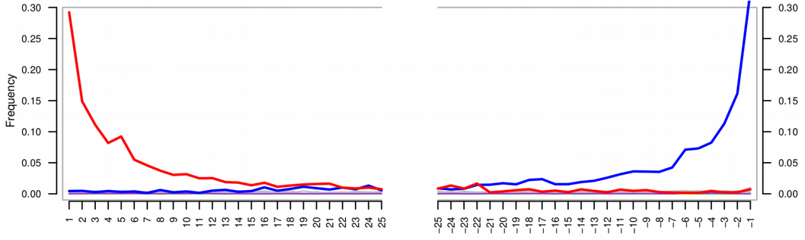

maDamage delivers a bunch of useful statistics, among other read length distribution can be checked. A typical mode of DNA reads should be within a range 30-70 base-pairs in order to be a good evidence of DNA fragmentation. Reads longer tha 100 base-pairs are more likely to originate from modern contamination.

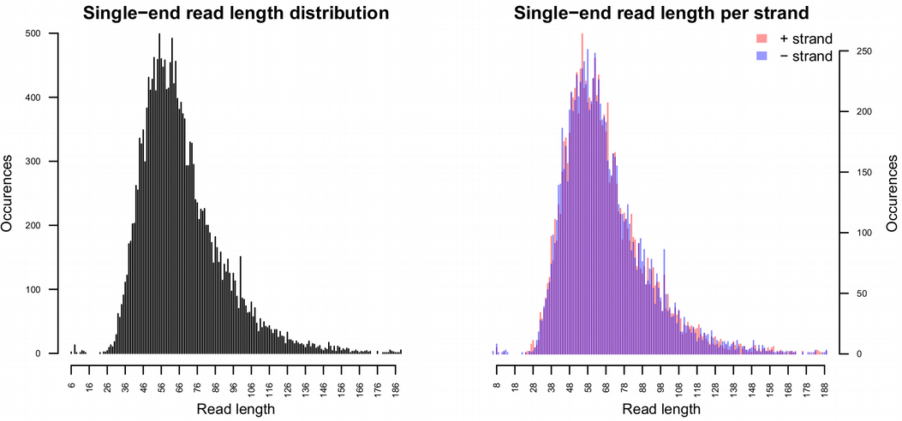

Another useful tool that can be applied to assess how DNA is damaged is [PMDtools](https://github.com/pontussk/PMDtools) which is a maximum-likelihood probabilistic model that calculates an ancient score, **PMD score**, for each read. The ability of PMDtools to infer ancient status with a single read resolution is quite unique and different from mapDamage that can only assess deamination based on a number of reads. PMD scores can be computed using the following command line, please note that Python2 is needed for this purpose.

```bash
git clone https://github.com/pontussk/PMDtools

conda deactivate
conda activate py27

samtools view -h Y.pestis_sample10.bam | python2 PMDtools/pmdtools.0.60.py \
 --printDS > PMDscores.txt
```

The distribution of PMD scores can be visualized via a histogram in R as follows:

```R
pmd_scores <- read.delim("PMDscores.txt", header = FALSE, sep = "\t")
hist(pmd_scores$V4, breaks = 1000, xlab = "PMDscores")
```

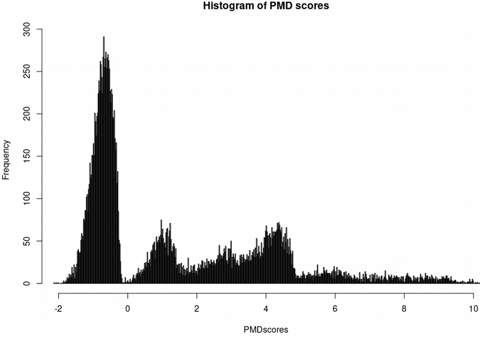

Typcally, reads with PMD scores greater than 3 are considered to be reliably ancient, i.e. damaged, and can be extracted for taking a closer look. Therefore PMDtools is great for separating ancient reads from modern contaminant reads.

As mapDamage, PMDtools can also compute demination profile. However, the advantage of PMDtools that it can compute deamination profile for UDG / USER treated samples (with the flag *--CpG*). For this purpose, PMDtools uses only CpG sites which escape the treatment, so deamination is not gone completely and there is a chance to authenticate treated samples. Computing deamination pattern with PMDtoools can be achieved with the following command line (please note that the scripts *pmdtools.0.60.py* and *plotPMD.v2.R* can be downloaded from the github repository here https://github.com/pontussk/PMDtools):

```bash
samtools view Y.pestis_sample10.bam | python2 PMDtools/pmdtools.0.60.py \
--platypus > PMDtemp.txt

R CMD BATCH PMDtools/plotPMD.v2.R
```

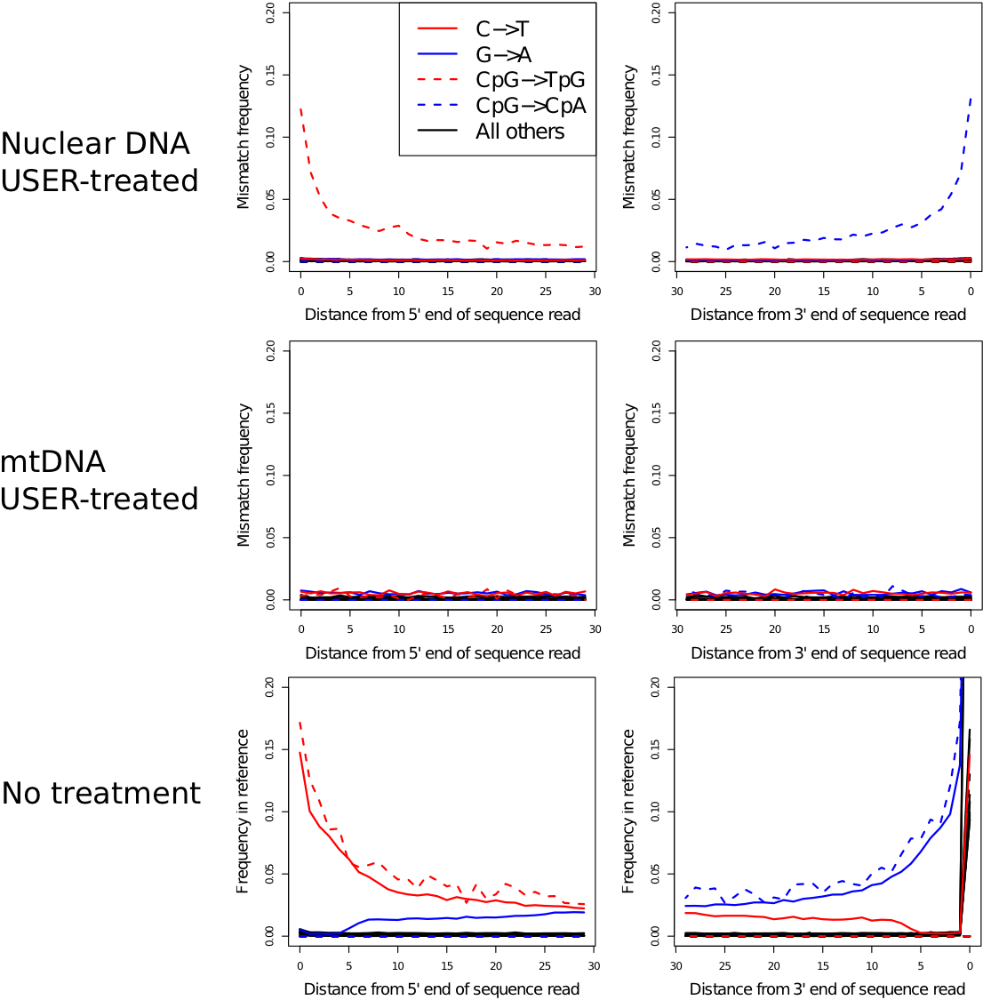

When performing ancient status analysis on **de-novo** assembled contigs, it can be computationally challenging and time consuming to run mapDamage or PMDtools on all of them as there can be hundreds of thousands contigs. In addition, the outputs from mapDamage and PMDtools lacking a clear numeric quantitiy or a statistical test that could provide an "ancient vs. non-ancient" desicion for each **de-novo** assembled contig. To address these limitations, [pyDamage](https://www.ncbi.nlm.nih.gov/pmc/articles/PMC8323603/pdf/peerj-09-11845.pdf) tool was recently developed. PyDamage evaluates the amount of aDNA damage and tests the hypothesis whether a model assuming presence of aDNA damage better explains the data than a null model.


pyDamage can be run on a sorted BAM-alignments of the microbial reads to the **de-novo** assembled contigs using the following command line:

```bash
pydamage analyze -w 30 -p 14 filtered.sorted.bam
```

# Microbiome contamination correction

Modern contamination can severely bias ancient metagenomic analysis. Also, ancient contamination, i.e. entered *post-mortem*, can potentially lead to false biological interpretations. Therefore, a lot of efforts in the ancient metagenomics field are directed on establishing methodology for identification of contaminants. Among them, the use of negative (blank) control samples is perhaps the most reliable and straighforward method. Additionally, one often performs microbial source tracking for predicting environment (including contamination environment) of origin for ancient metagenomic samples.

## Decontamination

Modern contamination is one of the major problems in ancient metagenomics analysis. Large fractions of modern bacterial, animal or human DNA in metagenomic samples can lead to false biological and historical conclusions. A lot of [scientific literature](https://onlinelibrary.wiley.com/doi/10.1002/bies.202000081) is dedicated to this topic, and comprehensive tables and sources of potential contamination (e.g. animal and bacterial DNA present in PCR reagensts) are available.

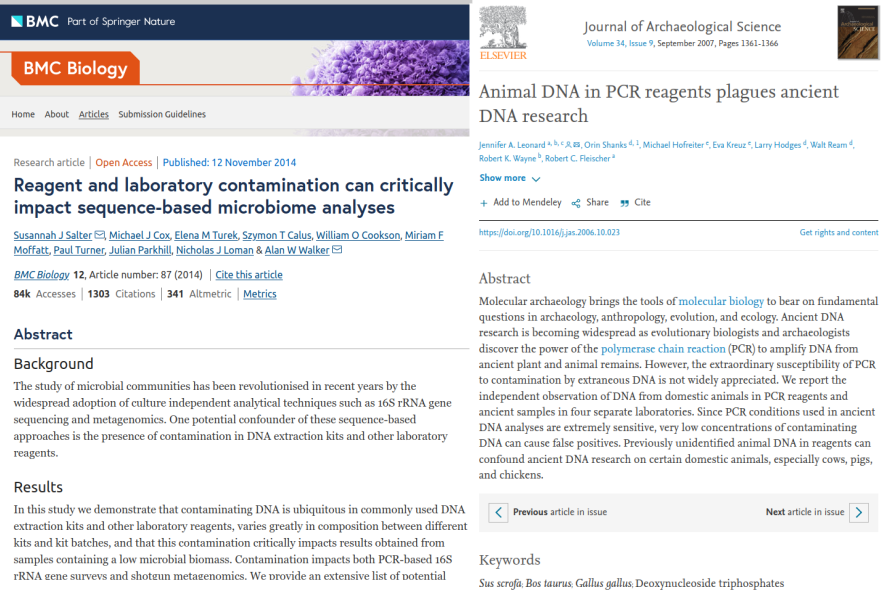

A good practice to discriminate between endogenous and contaminant organisms is to sequence negative controls, so-called **blanks**. Organisms detected on blanks, like the microbial genera reported in the table below, can substantially facilitate making more informed decision about true metagenomic profile of a sample. Nevertheless, the table below may seem rather conservative since in addition to well-known environmental contaminants as *Burkholderia* and *Pseudomonas* it includes also human oral genera as *Streptococcus*, which are probably less likely to be of environmental origin.

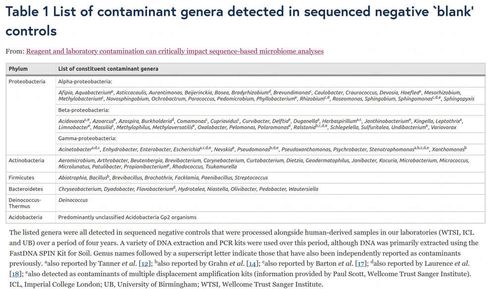

It is typically assumed that an organism found on a blank has a lower confidence to be endogenous to the studied metagenomic sample, and sometimes it is even expluded from the downstream analysis as an unreliable hit. Despite there are attempts to automate filtering out modern contaminants (we will discuss them below), decontamination process still remains to be a tidious manual work where each candidate should be carefully investigated from different contexts in order to prove its ancient and endogenous origin.

If negative control samples (balnks) are available, contaminating organisms can be detected by comparing their abundances in the negative controls with true samples. In this case, contaminant organisms stand out by their high prevalence in both types of samples if one simply plots mean across samples abundance of each detected organism in true samples and negative controls against each other as in the figure below:

```R
# NOTE: the R codes below should be run on your local computer.
# The input files are available in the "practicals"-folder after cloning
# https://github.com/NikolayOskolkov/Physalia_AncientMetagenomics_2025
# First, please, navigate to the "practicals"-folder as

setwd("/your_computer/Physalia_AncientMetagenomics_2025/practicals")

# then you can run the codes below using Rstudio

samples<-read.delim("krakenuniq_abundance_matrix.txt",header=TRUE,
row.names = 1, check.names = FALSE, sep = "\t")
controls<-read.delim("blank_krakenuniq_abundance_matrix.txt",header=TRUE,
row.names = 1, check.names = FALSE, sep = "\t")

df <- merge(samples, controls, all = TRUE, by = "row.names")
rownames(df)<-df$Row.names; df$Row.names <- NULL; df[is.na(df)] <- 0

true_sample <- subset(df,select=colnames(df)[!grepl("control",colnames(df))])
negative_control <- subset(df,select=colnames(df)[grepl("control",colnames(df))])

plot(log10(rowMeans(true_sample)+1) ~ log10(rowMeans(negative_control)+1),
xlab = "Log10 ( Negative controls )", ylab = "Log10 ( True samples )",
main = "Organism abundance in true samples vs. negative controls",
pch = 19, col = "blue")

points(log10(rowMeans(true_sample)+1)[(log10(rowMeans(true_sample)+1) > 1) & 
(log10(rowMeans(negative_control)+1)>1)] ~ 
log10(rowMeans(negative_control)+1)[(log10(rowMeans(true_sample)+1) > 1) & 
(log10(rowMeans(negative_control)+1)>1)], pch = 19, col = "red")

text(log10(rowMeans(true_sample)+1)[(log10(rowMeans(true_sample)+1) > 1) & 
(log10(rowMeans(negative_control)+1) > 1)] ~ 
log10(rowMeans(negative_control)+1)[(log10(rowMeans(true_sample)+1) > 1) & 
(log10(rowMeans(negative_control)+1)  >1)],
labels = rownames(true_sample)[(log10(rowMeans(true_sample)+1) > 1) & 
(log10(rowMeans(negative_control)+1) > 1)], pos = 4)
```

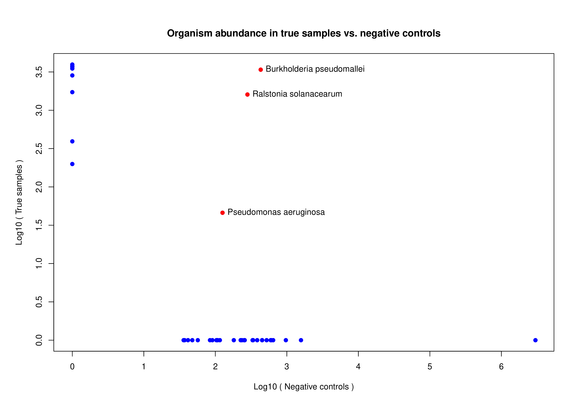

In the figure above, one point indicates an organism detected in a group of metagenomic samples. The points highlighted by red have high abundance in negative control samples, and therefore they are likely contamiannts.

In addition to PCR reagents and lab contaminants, reference databses can also be contaminanted by various, often microbial, organisms. A typical example that when screening environmental or sedimentary ancient DNA samples, a fish *Cyprinos carpio* can pop up if adapter trimming procedure was not successful for some reason.

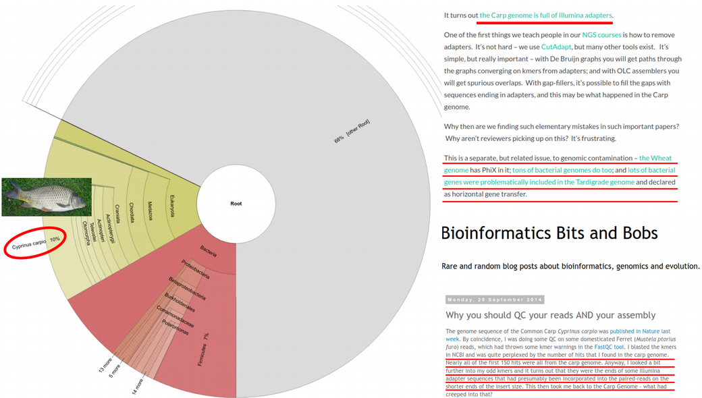

It was noticed that the *Cyprinos carpio* reference genome available at NCBI contains large fraction of Illumina sequncing adapters. Therefore, appearence of this organism in your analysis may falsely lead your conclusion toward potential lake or river present in the excavation site.


Let us now discuss a few available computational approaches to decontaminate metagenomic samples. One of them is [decontam](https://microbiomejournal.biomedcentral.com/articles/10.1186/s40168-018-0605-2) R package that offers a simple statistical test for whether a detected organism is likely contaminant. This approach is useful when DNA quantitation data recording the concentration of DNA in each sample (e.g. PicoGreen fluorescent intensity measures) is available. The idea of the *decontam* is that contaminant DNA is expected to be present in approximately equal and low concentrations across samples, while sample DNA concentrations can vary widely. As a result, the expected frequency of contaminant DNA varies inversely with total sample DNA concentration (red line in the figure below), while the expected frequency of non-contaminant DNA does not (blue line).

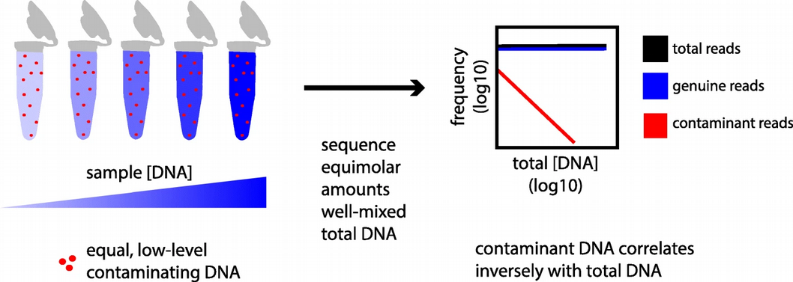

Another popular tool for detecting contaminating microorganisms is [Recentrifuge](https://journals.plos.org/ploscompbiol/article?id=10.1371/journal.pcbi.1006967). It works as a classifier that is trained to recognize contaminant microbial organisms. In case of Recentrifuge, one has to use blanks or other negative controls and provide microbial names and abundances on the blanks in order to train Recentrifuge to recognize endogenous vs. contaminant sources.

If one wants to assess the degree of contamination for each sample, there is a handy tool [cuperdec](https://github.com/jfy133/cuperdec), which is an R package that allows a quick comparison of microbial profiles in a query metagenomic sample against a database. The idea of *cuperdec* is to rank organisms in each sample by their abundance and then using an "expanding window" approach to compute their enrichment in a reference database that contains a comprehensive list of microbial organisms which are specific to a tissue / environment in question. The tool produces so-called *Cumulative Percent Decay* curves that aim to represent the level of endogenous content of microbiome samples, such as ancient dental calculus, to help to identify samples with low levels of preservation that should be discarded for downstream analysis.

```R
# NOTE: the R codes below should be run on your local computer.
# The input files are available in the "practicals"-folder after cloning
# https://github.com/NikolayOskolkov/Physalia_AncientMetagenomics_2025
# First, please, navigate to the "practicals"-folder as

setwd("/your_computer/Physalia_AncientMetagenomics_2025/practicals")

# Please make sure to have the three R packages below installed:
library("cuperdec"); library("magrittr"); library("dplyr")

# Load database (in this case oral database)
data(cuperdec_database_ex)
database <- load_database(cuperdec_database_ex, target = "oral") %>% print()

# Load abundance matrix and metadata
taxatable <- load_taxa_table("krakenuniq_abundance_matrix.txt")  %>% print()
metadata <- as_tibble(data.frame(Sample = unique(taxatable$Sample), 
Sample_Source = "Oral"))

# Compute cumulative percent decay curves, filter and plot results
curves <- calculate_curve(taxatable, database = database) %>% print()
filter_result <- simple_filter(curves, percent_threshold = 50) %>% print()
plot_cuperdec(curves, metadata = metadata, filter_result)
```

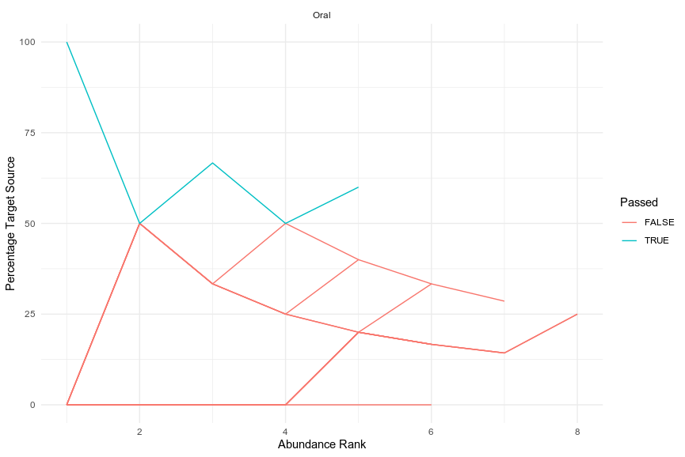

In the figure above, one curve represents one sample, and the red curves have a very high amount of contamination and very low amount of endogenous DNA. These samples might be considered to be dropped from the downstream analysis.

## Microbial source tracking

For the case of ancient microbiome profiling, in addition to traditional inspection of the list of detected organisms and comparing it with the ones detected on blanks, we can use tools that make a prediction on what environment the detected organisms most likely come from. 

The most popular and widely used tool is called [**SourceTracker**](https://www.nature.com/articles/nmeth.1650#citeas). SourceTracker is a Bayesian version of the Gaussian Mixture Model (GMM) clustering algorithm that is trained on a user-supplied reference data called **Sources**, i.e. different classes such as Soil or Human Oral or Human Gut microbial communities etc., and then it can estimate proportion / contribution of each of these sources the users actual samples called **Sinks**.

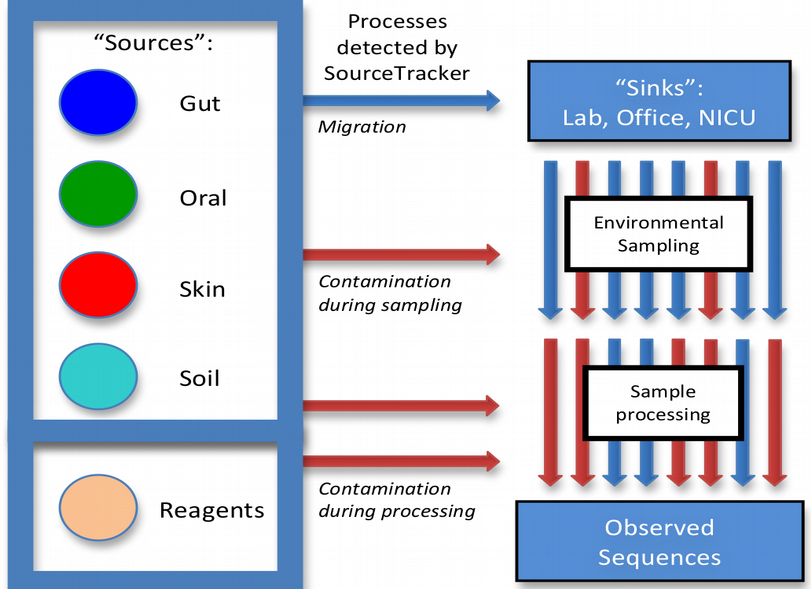

Originally, SourceTracker was developed for 16S data, i.e. using only 16S ribosomal RNA genes, but it can be easily trained using also shotgun metagenomics data, which was demonstrated in its metagenomic extension called [mSourceTracker](https://www.ncbi.nlm.nih.gov/pmc/articles/PMC7100590/) and its faster and more scalable version [FEAST](https://www.nature.com/articles/s41592-019-0431-x). The input data for SourceTracker are metadata, i.e. each sample has to have "source" or "sink" annotation as well as environmental label (e.g. Oral, Gut, Soil etc.), and microbial abundances (OTU abundances) quantified in some way, for example through [QIIME](https://qiime2.org/) pipeline, MetaPhlan or Kraken. The SourceTracker R script can be downloaded from [https://github.com/danknights/sourcetracker](https://github.com/danknights/sourcetracker).
 
 Sourcetracker expects two input data frames: metadata with at least sample name, environment and source / sink labels, and abundance matrix. Note that source and sink metadata and abundances have to be merged together prior to using SourceTracker. Here we are going to use data from the [Human Microbiome Project (HMP)](https://hmpdacc.org/) as sources, and we are going to merge the HMP data with the sink samples into single OTU table and meta-data table.

```R
# NOTE: the R codes below should be run on your local computer.
# The input files are available in the "practicals"-folder after cloning
# https://github.com/NikolayOskolkov/Physalia_AncientMetagenomics_2025
# First, please, navigate to the "practicals"-folder as

setwd("/your_computer/Physalia_AncientMetagenomics_2025/practicals")

# then you can run the codes below using Rstudio

otus_hmp <- read.delim("otus_hmp.txt", header = TRUE, row.names = 1, sep = "\t")
meta_hmp <- read.delim("meta_hmp.txt", header = TRUE, row.names = 1, sep = "\t")

otus_sink<-read.delim("krakenuniq_abundance_matrix.txt",header=T,row.names=1,sep="\t")
otus <- merge(otus_hmp, otus_sink, all = TRUE, by = "row.names")
rownames(otus) <- otus$Row.names; otus$Row.names <- NULL; otus[is.na(otus)] <- 0
meta_sink <- data.frame(ID = colnames(otus_sink), Env = "Unknown", SourceSink = "sink")
rownames(meta_sink) <- meta_sink$ID; meta_sink$ID<-NULL
metadata <- rbind(meta_hmp, meta_sink)

otus <- as.data.frame(t(as.matrix(otus)))
otus[otus > 0] <- 1; otus <- otus[rowSums(otus)!=0,]
metadata<-metadata[as.character(metadata$Env)!="Vaginal",]; envs <- metadata$Env
common.sample.ids <- intersect(rownames(metadata), rownames(otus))
otus <- otus[common.sample.ids,]; metadata <- metadata[common.sample.ids,]
```

Next, training SourceTracker on source samples and running predictions on sink samples can be done using following command lines:

```R
# Train SourceTracker on sources (HMP) and run predictions on sinks
source('SourceTracker.r')
train.ix <- which(metadata$SourceSink=='source')
test.ix <- which(metadata$SourceSink=='sink')
st <- sourcetracker(otus[train.ix,], envs[train.ix])
results <- predict(st, otus[test.ix,], alpha1 = 0.001, alpha2 = 0.001)
```

Finally, we can plot SourceTracker environment inference in the form of barcharts as follows:

```R
# Sort SourceTracker proportions for plotting
props <- results$proportions
props <- props[order(-props[,"Oral"]),]
results$proportions <- props

# Prepare SourceTracker output for plotting
name <- rep(rownames(results$proportions), each = 4)
value <- as.numeric(t(results$proportions))
labels <- c("Gut","Oral","Skin","Unknown"); condition<-rep(labels, length(test.ix))
data <- data.frame(name, condition, value)

# Plot SourceTracker inference as a barplot
library("ggplot2")
ggplot(data, aes(fill=condition, y=value, x = reorder(name, seq(1:length(name))))) + 
geom_bar(position = "fill", stat = "identity") + 
theme(axis.text.x = element_text(angle = 90, size=5, hjust=1, vjust=0.5)) + 
xlab("Sample") + ylab("Fraction")
```

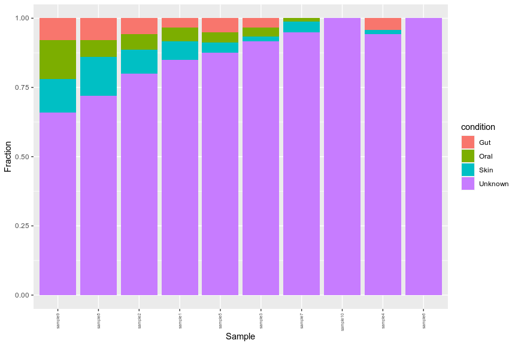

In the figure above the SourceTracker was trained on Human Microbiome Project (HMP) data, and was capable of predicting the fractions of oral, gut, skin or other microbial composition on the query sink samples. In a similar way, environmental soil or marine microbes can be used as Sources. In this way, environmental percentage of contamination can be detected per sample.

A drawback of SourceTracker, mSourceTracker and FEAST is that they require a microbial abundance table after a taxonomic classification with e.g. QIIME or Kraken has been performed. Such taxonomic classification can be biased since it is computed against a reference database with known taxonomic annotation. In contrast, a novel microbial source tracking tool [decOM](https://www.biorxiv.org/content/10.1101/2023.01.26.525439v1.full) aims at moving away from database-dependent methods and using unsupervised approaches exploiting read-level sequence composition.


*decOM* uses [kmtricks](https://academic.oup.com/bioinformaticsadvances/article/2/1/vbac029/6576015) to compute a matrix of k-mer counts on raw reads (FASTQ files) from source samples, and then uses the source k-mer abundance matrix for looking up k-mer composition of sink samples. This allows *decOM* to calculate microbial contributions / fractions from the sources. For example, for estimating contributions from ancient Oral (aOral), modern Oral (mOral), Skin and Sediment / Soil environments one can use an already computed source matrix from here [https://github.com/CamilaDuitama/decOM/](https://github.com/CamilaDuitama/decOM/) and provide it as a *-p_sources* parameter. Then *decOM* can be run using the following command line:

```bash
# decOM can be installed in the following way:
# git clone https://github.com/CamilaDuitama/decOM.git
# cd decOM
# conda env create -n decOM --file environment.yml

conda activate decOM 

# Prepare input fof-files that have a key - value format
cd 03_TRIMMED # folder containing trimmed fastq-files
for i in {1..10}
do
echo "sample${i}_trimmed : sample${i}_trimmed.fastq.gz" > sample${i}_trimmed.fof
echo sample${i}_trimmed >> FASTQ_NAMES_LIST.txt
done

# Download pre-built kmer-matrix of sources (aOral, mOral, Sediment/Soil, Skin)
wget https://zenodo.org/record/6513520/files/decOM_sources.tar.gz
tar -xf decOM_sources.tar.gz

# Run decOM predictions
decOM -p_sources decOM_sources/ -p_sinks FASTQ_NAMES_LIST.txt \
-p_keys ~/Physalia_AncientMetagenomics_2025/03_TRIMMED -mem 15GB -t 4
```

In the command line above, he *-p_sinks* parameter provides a list of sink samples, for example *SRR13355807*.
The sink fastq-files are placed in *decOM/FASTQ* together with *keys* fof-files containing the mapping between fastq file names and locations of the fastq-files, for example *SRR13355807 : decOM/FASTQ/SRR13355807.fastq.gz*. The contributions from the sources to the sink samples, which are recorded in the *decOM_output.csv* output file, can then be processed and plotted as follows:

```R
# NOTE: the R codes below should be run on your local computer.
# The input files are available in the "practicals"-folder after cloning
# https://github.com/NikolayOskolkov/Physalia_AncientMetagenomics_2025
# First, please, navigate to the "practicals"-folder as

setwd("/your_computer/Physalia_AncientMetagenomics_2025/practicals")

# then you can run the codes below using Rstudio

df<-read.csv("decOM_output.csv", check.names=FALSE)

result <- subset(df, select = c("Sink", "Sediment/Soil", "Skin", "aOral", 
"mOral", "Unknown"))
rownames(result) <- result$Sink; result$Sink <- NULL
result <- result / rowSums(result)
result<-result[order(-result$aOral),]

name <- rep(rownames(result), each = 5); value <- as.numeric(t(result))
condition <- rep(c("Sediment/Soil","Skin","aOral","mOral","Unknown"), 
dim(result)[1])
data <- data.frame(name, condition, value)

library("ggplot2"); library("viridis")
ggplot(data, aes(fill=condition, y=value, x=reorder(name,seq(1:length(name))))) + 
  geom_bar(position = "fill", stat = "identity") + 
  theme(axis.text.x = element_text(angle=90, size = 5, hjust = 1, vjust = 0.5)) + 
  xlab("Sample") + ylab("Fraction")
```

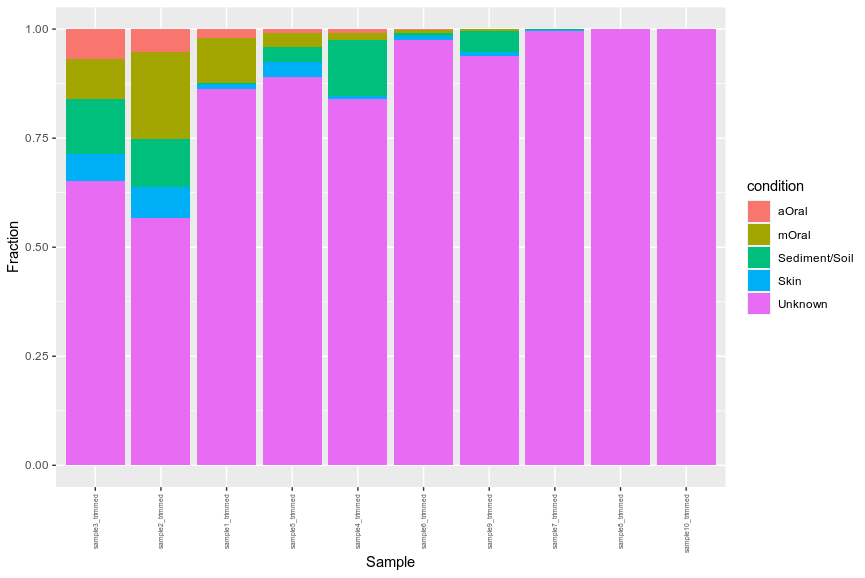

*decOM* has certain advantages compared to *SourceTracker* as its is a taxonomic classification / database free approach. However, it also appears to be very sensitive to the particular training / source data set. In the example above it can be seen that the microbial source tracking of sink samples is very much dominated by the Oral community, which was the training / source data set.


## Summary

In this setion we have learned that:

- Evenness of coverage is an important metric for validation of findings

- Deamination profile, DNA fragmentation, mapping quality, edit distance and PMD scores are other authentication / validation metrics to consider

- Negative controls are important for disentangling ancient / endogenous from modern / exogenous contamination

- Microbial source tracking is another layer of evidence that can facilitate interpretation of ancient metagenomic findings


## Questions to think about

1. What is a false-positive microbial finding and how can we recognize it?

2. What is the diffeerence between depth, breadth and evenness of coverage?

3. What is contamination and how can it bias ancient metagenomic analysis?

4. How can we separate ancient from modern DNA sequence?

5. What is a negative (blank) control sample and why is it useful to have?

6. What is microbial source tracking and how can it help with decontamination?


## Readings

1. Clio Der Sarkissian, Irina M. Velsko, Anna K. Fotakis, Åshild J. Vågene, Alexander Hübner, and James A. Fellows Yates, Ancient Metagenomic Studies: Considerations for the Wider Scientific Community, mSystems 2021 Volume 6  Issue 6  e01315-21.

2. Warinner C, Herbig A, Mann A, Fellows Yates JA, Weiß CL, Burbano HA, Orlando L, Krause J. A Robust Framework for Microbial Archaeology. Annu Rev Genomics Hum Genet. 2017 Aug 31;18:321-356. doi: 10.1146/annurev-genom-091416-035526. Epub 2017 Apr 26. PMID: 28460196; PMCID: PMC5581243.

3. Orlando, L., Allaby, R., Skoglund, P. et al. Ancient DNA analysis. Nat Rev Methods Primers 1, 14 (2021). https://doi.org/10.1038/s43586-020-00011-0


## Resources

1. **KrakenUniq**: Breitwieser, F. P., Baker, D. N., & Salzberg, S. L. (2018). KrakenUniq: confident and fast metagenomics classification using unique k-mer counts. Genome Biology, vol. 19(1), p. 1–10. http://www.ec.gc.ca/education/default.asp?lang=En&n=44E5E9BB-1

2. **Samtools**: Heng Li, Bob Handsaker, Alec Wysoker, Tim Fennell, Jue Ruan, Nils Homer, Gabor Marth, Goncalo Abecasis, Richard Durbin, 1000 Genome Project Data Processing Subgroup, The Sequence Alignment/Map format and SAMtools, Bioinformatics, Volume 25, Issue 16, 15 August 2009, Pages 2078–2079, https://doi.org/10.1093/bioinformatics/btp352

3. **PMDtools**: Skoglund P, Northoff BH, Shunkov MV, Derevianko AP, Pääbo S, Krause J, Jakobsson M. Separating endogenous ancient DNA from modern day contamination in a Siberian Neandertal. Proc Natl Acad Sci U S A. 2014 Feb 11;111(6):2229-34. doi: 10.1073/pnas.1318934111. Epub 2014 Jan 27. PMID: 24469802; PMCID: PMC3926038.

4. **pyDamage**: Borry M, Hübner A, Rohrlach AB, Warinner C. PyDamage: automated ancient damage identification and estimation for contigs in ancient DNA de novo assembly. PeerJ. 2021 Jul 27;9:e11845. doi: 10.7717/peerj.11845. PMID: 34395085; PMCID: PMC8323603.

5. **SourceTracker**: Knights D, Kuczynski J, Charlson ES, Zaneveld J, Mozer MC, Collman RG, Bushman FD, Knight R, Kelley ST. Bayesian community-wide culture-independent microbial source tracking. Nat Methods. 2011 Jul 17;8(9):761-3. doi: 10.1038/nmeth.1650. PMID: 21765408; PMCID: PMC3791591.

6. **deCOM**: https://www.biorxiv.org/content/10.1101/2023.01.26.525439v1, doi: https://doi.org/10.1101/2023.01.26.525439

7. **aMeta**: https://www.biorxiv.org/content/10.1101/2022.10.03.510579v1, doi: https://doi.org/10.1101/2022.10.03.510579

8. **Bowtie2**: Langmead, B., Salzberg, S. Fast gapped-read alignment with Bowtie 2. Nat Methods 9, 357–359 (2012). https://doi.org/10.1038/nmeth.1923

9. **cuperdec**: https://cran.r-project.org/web/packages/cuperdec/index.html

10. **decontam**: https://www.bioconductor.org/packages/release/bioc/html/decontam.html


## Microbial contamination in eukaryotic references

In this exercise we will explore a computational workflow for detecting coordinates of microbial-like sequences in eukaryotic reference genomes. The workflow accepts a reference genome in FASTA-format and outputs coordinates of microbial-like regions in BED-format. The workflow builds a Bowtie2 index of the eukaryotic reference genome and aligns pre-computed microbial GTDB v.214 (https://gtdb.ecogenomic.org/) pseudo-reads to the reference, then custom scripts are used for detection of the positions of covered regions and quantification of most abundant microbial contaminants.

Please note that in this gitub reporsitory, we provide a small subset of microbial pseudo-reads for demonstration purposes, the full dataset is available at the SciLifeLab Figshare https://doi.org/10.17044/scilifelab.28491956.

Please clone this repository and read the very detailed `vignette.html`, please follow the preparation steps described in the vignette, after that the workflow can be executed as:

    cd /home/nikolay
    git clone https://github.com/NikolayOskolkov/MCWorkflow
    cd MCWorkflow
    ./micr_cont_detect.sh GCF_002220235.fna.gz /home/nikolay/MCWorkflow/data GTDB 4 \
    GTDB_sliced_seqs_sliding_window.fna.gz GTDB_fna2name.txt

The vignette `vignette.html` walks you through the explanations of the workflow parameters and interpretation of the output files.


## aMeta: introduction and installation

In this chapter, we will demonstrate an example of using aMeta, an accurate and memory-efficient ancient Metagenomic profiling workflow proposed in [Pochon et al. 2023](https://www.biorxiv.org/content/10.1101/2022.10.03.510579v1).


It can be cloned from NBISweden github repository and installed as follows:

```bash
git clone https://github.com/NBISweden/aMeta
cd aMeta
#conda env create -f workflow/envs/environment.yaml
conda activate aMeta
```

To ensure that aMeta has been correctly installed, we can run a quick test:

```bash
cd .test
./runtest.sh -j 1
```

## Downloading data, databases and indexes

For demonstration purposes we will use 10 simulated with [gargammel](https://academic.oup.com/bioinformatics/article/33/4/577/2608651) ancient metagenomic samples used for benchmarking aMeta. The simulated data can be accessed via [https://doi.org/10.17044/scilifelab.21261405](https://doi.org/10.17044/scilifelab.21261405) and downloaded via terminal using following command lines:

```bash
cd aMeta
cp -r ~/Share/data .

# In case you want to download the data, they are available here:
#wget https://figshare.scilifelab.se/ndownloader/articles/21261405/versions/1 \
#&& export UNZIP_DISABLE_ZIPBOMB_DETECTION=true && unzip 1 && rm 1
```

To run aMeta, we willl need a small KrakenUniq database. Here we download a pre-built database based on complete microbial NCBI RefSeq reference genomes:

```bash
cd aMeta/resources
cp -r ~/Share/Databases/KrakenUniq_DB .

# In case you want to download the database, it is available here:
#wget https://figshare.scilifelab.se/ndownloader/articles/21299541/versions/1 \
#&& export UNZIP_DISABLE_ZIPBOMB_DETECTION=true && unzip 1 && rm 1
```

We will also need a Bowtie2 index corresponding to the KrakenUniq reference database:

```bash
cd aMeta/resources
cp -r ~/Share/Databases/Bowtie2_index .

# In case you want to download the Bowtie2 index, it is available here:
#wget https://figshare.scilifelab.se/ndownloader/articles/21185887/versions/1 \
#&& export UNZIP_DISABLE_ZIPBOMB_DETECTION=true && unzip 1 && rm 1
```

The last thing we need to download are a few helping files with useful NCBI taxonomy information:

```bash
cd aMeta/resources
#wget https://figshare.scilifelab.se/ndownloader/files/38201982 && \
#mv 38201982 seqid2taxid.map.orig
cp ~/Share/seqid2taxid.map.orig .
#wget https://figshare.scilifelab.se/ndownloader/files/38201937 && \
#mv 38201937 nucl_gb.accession2taxid
cp ~/Share/nucl_gb.accession2taxid .
cp -r ~/Share/Databases/Bowtie2_index .
cp ~/Share/library.fna .
#wget https://figshare.scilifelab.se/ndownloader/files/37395181 && \
#mv 37395181 library.fna.gz && gunzip library.fna.gz
```


## aMeta configuration

Now we need to configure the workflow. First, we need to create a tab-delimited *samples.tsv* file inside *aMeta/config* and provide the names of the input fastq-files:

```bash
sample  fastq
sample1 data/sample1.fastq.gz
sample2 data/sample2.fastq.gz
sample3 data/sample3.fastq.gz
sample4 data/sample4.fastq.gz
sample5 data/sample5.fastq.gz
sample6 data/sample6.fastq.gz
sample7 data/sample7.fastq.gz
sample8 data/sample8.fastq.gz
sample9 data/sample9.fastq.gz
sample10 data/sample10.fastq.gz

```

Further, we will put details about e.g. databases locations in the *config.yaml* file inside *aMeta/config*. A minimal example *config.yaml* files can look like this:

```bash
samplesheet: "config/samples.tsv"

krakenuniq_db: resources/KrakenUniq_DB

bowtie2_db: resources/Bowtie2_index/library.pathogen.fna
bowtie2_seqid2taxid_db: resources/Bowtie2_index/seqid2taxid.pathogen.map
pathogenomesFound: resources/Bowtie2_index/pathogensFound.very_inclusive.tab

malt_nt_fasta: resources/library.fna
malt_seqid2taxid_db: resources/seqid2taxid.map.orig
malt_accession2taxid: resources/nucl_gb.accession2taxid

ncbi_db: resources/ncbi

n_unique_kmers: 1000
n_tax_reads: 200

```


## Prepare and run aMeta

Next, we need to create conda sub-environments of aMeta, then manually tune a few memory related parameters of tools (Krona and Malt) included in aMeta:

```bash
snakemake --snakefile workflow/Snakefile --use-conda --conda-create-envs-only -j 20

env=$(grep krona .snakemake/conda/*yaml | awk '{print $1}' | sed -e "s/.yaml://g" \
| head -1)
cd $env/opt/krona/
./updateTaxonomy.sh taxonomy
cd -

cd aMeta
env=$(grep hops .snakemake/conda/*yaml | awk '{print $1}' | sed -e "s/.yaml://g" \
| head -1)
conda activate $env
version=$(conda list malt --json | grep version | sed -e "s/\"//g" | awk '{print $2}')
cd $env/opt/malt-$version
sed -i -e "s/-Xmx64G/-Xmx96G/" malt-build.vmoptions
sed -i -e "s/-Xmx64G/-Xmx96G/" malt-run.vmoptions
cd -
conda deactivate
```

And, finally, we are ready to run aMeta:

```bash
snakemake --snakefile workflow/Snakefile --use-conda -j 20
```

## aMeta output

All output files of the workflow are located in *aMeta/results* directory. To get a quick overview of ancient microbes present in your samples you should check a heatmap in *results/overview_heatmap_scores.pdf*.

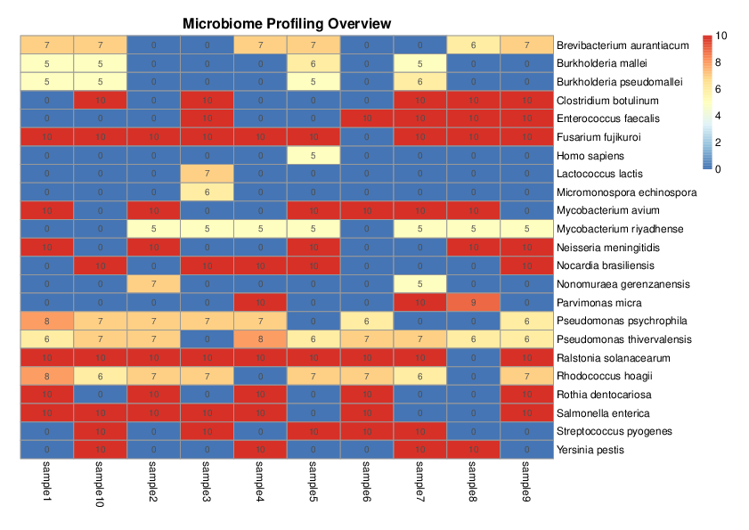

The heatmap demonstrates microbial species (in rows) authenticated for each sample (in columns). The colors and the numbers in the heatmap represent authentications scores, i.e. numeric quantification of seven quality metrics that provide information about microbial presence and ancient status. The authentication scores can vary from 0 to 10, the higher is the score the more likely that a microbe is present in a sample and is ancient. Typically, scores from 8 to 10 (red color in the heatmap) provide good confidence of ancient microbial presence in a sample. Scores from 5 to 7 (yellow and orange colors in the heatmap) can imply that either: a) a microbe is present but not ancient, i.e. modern contaminant, or b) a microbe is ancient (the reads are damaged) but was perhaps aligned to a wrong reference, i.e. it is not the microbe you think about. The former is a more common case scenario. The latter often happens when an ancient microbe is correctly detected on a genus level but we are not confident about the exact species, and might be aligning the damaged reads to a non-optimal reference which leads to a lot of mismatches or poor evennes of coverage. Scores from 0 to 4 (blue color in the heatmap) typically mean that we have very little statistical evedence (very few reads) to claim presence of a microbe in a sample.

To visually examine the seven quality metrics

- deamination profile,
- evenness of coverage,
- edit distance (amount of mismatches) for all reads,
- edit distance (amount of mismatches) for damaged reads,
- read length distribution,
- PMD scores distribution,
- number of assigned reads (depth of coverage),

corresponding to the numbers and colors of the heatmap, one can find them in results/AUTHENTICATION/sampleID/taxID/authentic_Sample_sampleID.trimmed.rma6_TaxID_taxID.pdf for each sample sampleID and each authenticated microbe taxID. An example of such quality metrics is shown below:

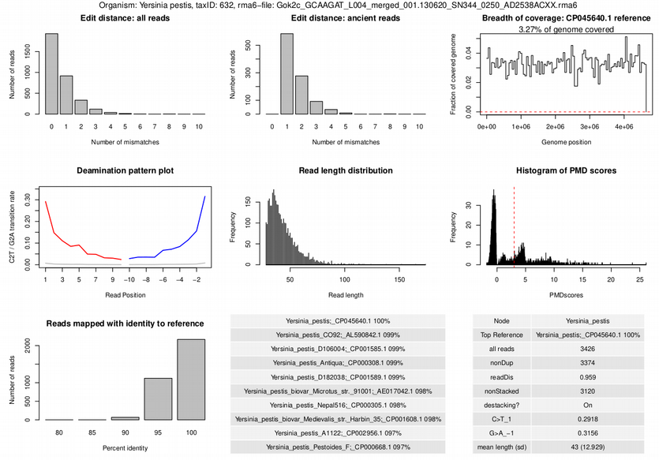


## Metagenome assembly

Now it's time to move forward to metagenome assembly. For the assembly we will use [Megahit](https://github.com/voutcn/megahit) which is is an ultra-fast and memory-efficient NGS assembler. 
It is optimized for metagenomes, but also works well on generic single genome assembly (small or mammalian size) and single-cell assembly.

Before you start the assembly, have a look at the [Megahit usage examples](https://github.com/voutcn/megahit?tab=readme-ov-file#usage), and the [Megahit publication](https://academic.oup.com/bioinformatics/article/31/10/1674/177884).  

__What options do we need?__
We have only given the output directory in the script below; modify it as necessary and run `megahit`:

```bash 
cd ~/Physalia_AncientMetagenomics_2025

conda activate ancientmetagenomics

megahit -r 04_HOST_REMOVAL/sample10_unaligned_to_hg38.fastq.gz --out-dir 08_ASSEMBLY --min-contig-len 100 -t 4

```

### Assembly QC

Now we are going to explore the assembled contigs. First, we will run QC for the assembled contigs and compute N50 value.

```bash
mkdir 09_ASSEMBLY_QC

conda activate ancientmetagenomics

# check assembly quality statistics with callN50 JavaScript script 
# that requires the k8 JavaScript shell (or node) to be installed
# download callN50: wget https://raw.githubusercontent.com/lh3/calN50/master/calN50.js

# if you need to install k8 please run
# wget -O- https://github.com/attractivechaos/k8/releases/download/v1.2/k8-1.2.tar.bz2 | tar -jxf -
# however, k8 is already installed for you in ~/Share/k8-1.2/ 

~/Share/k8-1.2/./k8-x86_64-Linux ~/Share/calN50.js 08_ASSEMBLY/final.contigs.fa > 09_ASSEMBLY_QC/assemstats.txt
```

N50 has a complex meaning. It is some sort of "average" (or representative) contig length but not exactly.

If we have contigs with length: 2,3,4,5,6,7,8,9,10 then the total assembled length is 2+3+4+5+6+7+8+9+10=54, then the largest contigs of length 10+9+8=27 make half of assembled length, therfore N50=8 and L50=3, 
i.e. 8 is the length of the smallest contig which in the sum with larger contigs make 50% of total assembled length, and 3 is the number of contigs of lengths greater or equal 8 which together make 50% of assembled length.


In this tutorial, you should see that we assembled 11 contigs of total length 1465 bp and N50=136 bp which is the "average" / "typical" or "median" contig length, and L50=5 contigs with length greater or equal than 136 bp make 50% of total assembled length.

### Abundance quantification of assembled contigs

Now, when we have assembled contigs, we might wonder what organisms they correspond to and how abundant these organisms are in our samples.

To quantify abundance of each assembled contig, let us now align the trimmed reads back to assembled contigs. We will do it with `Bowtie2` aligner, and we will first have to build the index for the assembled contigs.

```bash
bowtie2-build --large-index 08_ASSEMBLY/final.contigs.fa 06_ASSEMBLY/final.contigs.fa --threads 4

bowtie2 --large-index -x 08_ASSEMBLY/final.contigs.fa --end-to-end --threads 4 --very-sensitive \
03_TRIMMED/${sample}.trimmed.fastq.gz | samtools view -bS -h -q 1 -@ 4 - \
> 09_ASSEMBLY_QC/aligned_to_assembled_contigs.bam

samtools view 09_ASSEMBLY_QC/aligned_to_assembled_contigs.bam | cut -f3 > 09_ASSEMBLY_QC/contig_count.txt
```

Above, we generated a bam-alignment where it is recorded to what contig each read is aligned. Then we used samtools to extract a list of contigs corresponding to each aligned read.
Now let us order the assembled contigs by their abundance, we will use R for this purpose:

```R
df<-scan("09_ASSEMBLY_QC/contig_count.txt",what="character")

head(sort(table(df),TRUE))

write.table(data.frame(sort(table(df),TRUE)),file="09_ASSEMBLY_QC/abund_contigs.txt",
col.names=FALSE,row.names=TRUE,quote=FALSE,sep="\t")
```
Finally, let us display top-abundant contigs:


```bash
head 09_ASSEMBLY_QC/abund_contigs.txt
```

Can you name a few most abundant contigs?

### Taxonomic annotation of assembled contigs

Now, we will figure out what organisms with available taxonomic annotation correspond to the assembled contigs. We will use Kraken2 for assigning taxa to assembled contigs:

```bash
conda activate ancientmetagenomics

kraken2 --db ~/Share/Databases/minikraken2_v2_8GB_201904_UPDATE --threads 4 \
--output 09_ASSEMBLY_QC/sequences.kraken_contigs --use-names \
--report 09_ASSEMBLY_QC/kraken.output_contigs 06_ASSEMBLY/final.contigs.fa
```

Please explore the taxonomic annotation of the assembled contigs and compare it with the read-based taxonomic profiling results.


